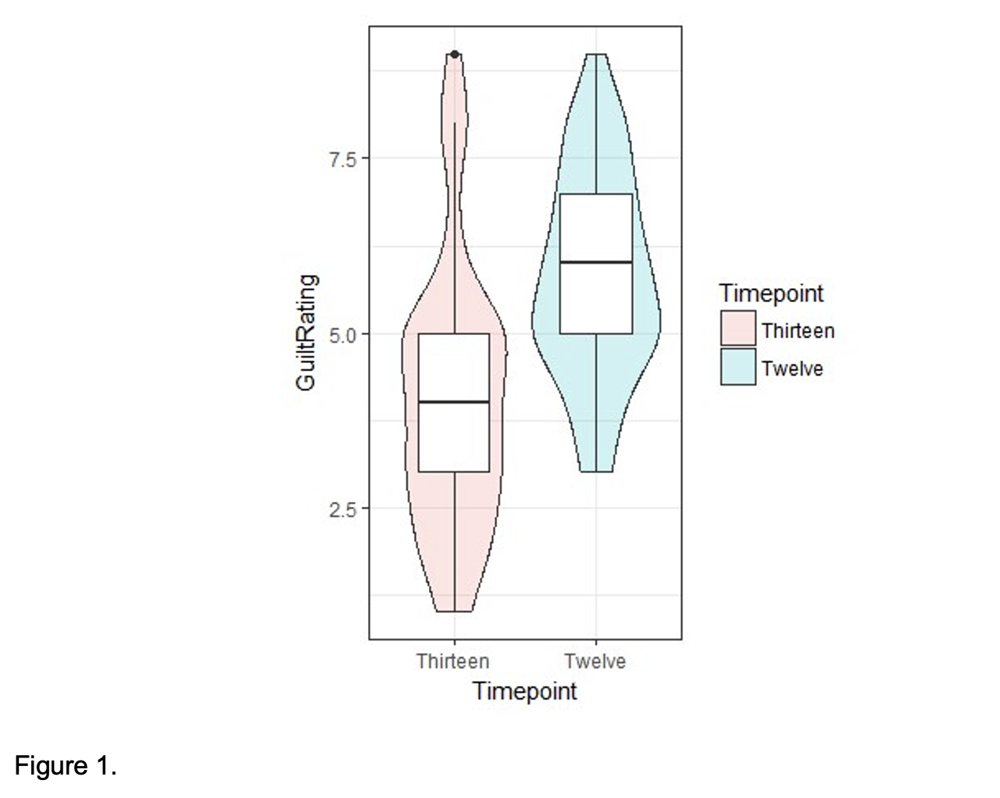
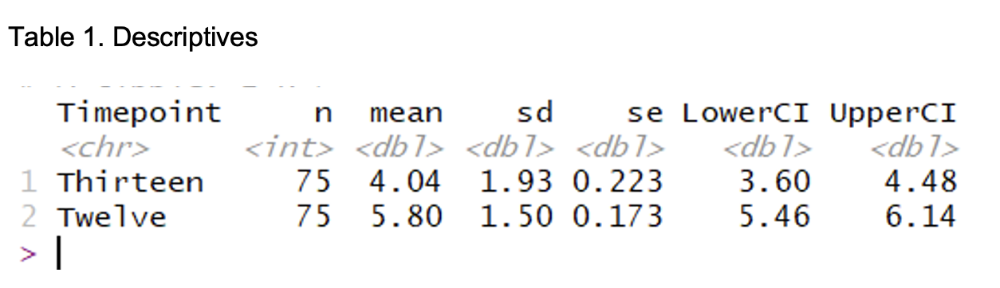
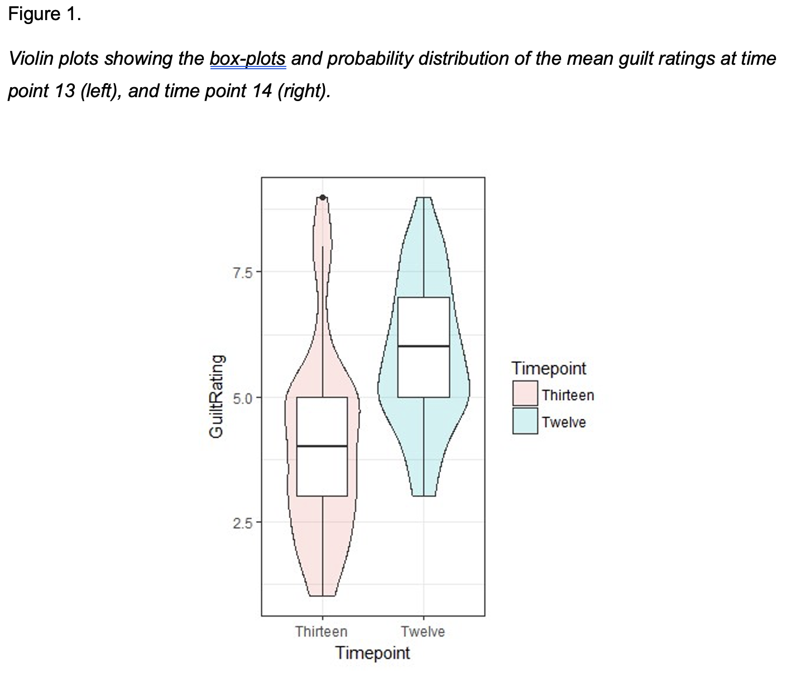
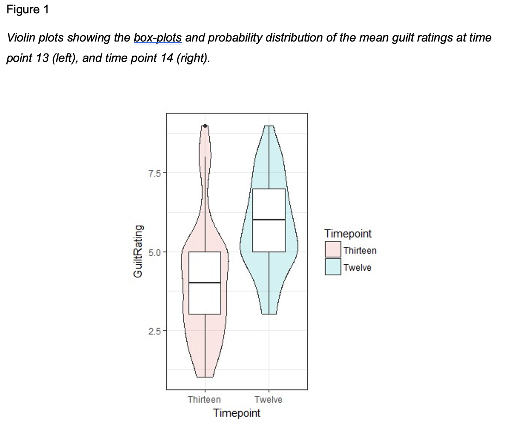
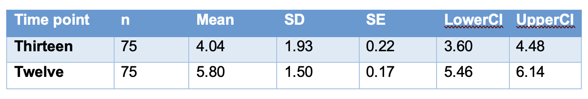
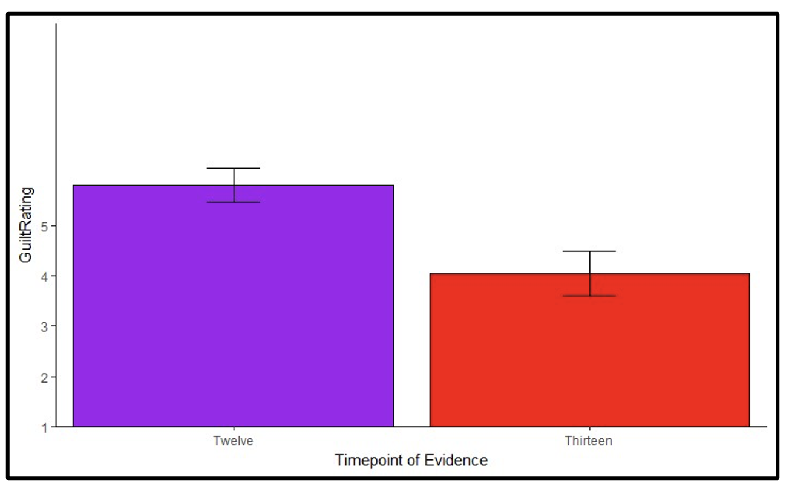

# Week 8

## Lab overview

This week is the second part of breaking down the results section. Last week, we focused on reporting the results of a correlation, and this week will cover reporting the results of a t-test. The structure is almost identical for the five to six key components, but there are some subtle differences in what you would report for a t-test compared to what you would report for a correlation.

This week, we will also spend a little time on data visualisation, either through plots or tables. We will cover some key APA style elements for formatting plots and tables, and highlight some principles to keep in mind when visualising data. 

After reading about the structure of the results section applied to t-test, we have another task for you to compare different versions of a results section. This requires you to understand what information should be reported and recognise what information is present, absent, or inaccurate. The versions can be ranked to identify the best example, but even the best one can be improved. So, your task will be to rank the versions based on their strengths and weaknesses, then discuss what could be improved about the best one in the lab. 

## Tasks to complete prior to your lab

1. Read through the [data visualisation and t-test results chapter](#visualisation-results).

2. Read through the [task context and comparison](#C8-task) section below to judge different attempts at writing up a t-test. 

## Tasks to complete after attending your lab

1. Reflect on what you learnt in the t-test results comparison task to feed into your own results section in the stage two individual report. 

2. Final editing of your stage one report to submit prior to the deadline. 

## Next week

Next week, you will have submitted your stage one group report, so it will be time to focus on the stage two individual report. Now you have your plan, you will be able to analyse the full data set to see what it means for your research question and hypothesis (if you have one). So, the first part of week 9 will be dedicated to thinking about the data processing pipeline for the full data set. The second part of week 9 will outline the structure of the discussion section. 

## Task context and comparison{#C8-task}

We have five different write-ups of the same results and we would like you to read through them and decide a) what is the order of best to worst, and b) how would you improve the best one? You can do this task yourself or in a group. The key to this task is thinking about the comparison between the versions, so be sure to actively make notes on what made one version better than another. 

To help you think about your decision, here are some of the elements that we tend to look at when we evaluate results sections:

**Knowledge and Research**: Has the person understood the purpose of a results section, that they know about assumptions for tests, and that they understand the relationship between the design and analysis? This means judging whether they have picked appropriate visualisation, descriptive statistics, and inferential statistics.

**Critical Evaluation**: Has the person summarised their inferences for the section without going into theoretical or practical implications which should be kept to the discussion? Usually, we just include a sentence or two at the end that draws things together, saying if there was a significant or non-significant effect and interprets the direction and size of any effect for the reader.

**Academic Communication**: Has the person followed common conventions in presenting results? For instance, using APA notation for statistics, figures and tables, and open science conventions for presenting both raw data and summary statistics in visualisations.

### Task context

The results deal with an in-house replication of Furnham (1986) who used the transcripts of a trial from 1906 to study the effect of the order of evidence presentation on jury decision making. We recruited participants to listen to 14 audio clips of the presented evidence and after each clip recorded whether participants thought the defendant was guilty or not guilty on a 9-point Likert scale. 

The manipulation in the experiment was the presentation of a key and crucial piece of evidence either in the middle of the trial (middle group) or at the end of the trial (late group) that proved the defendant, Mr Joseph Parker, was **innocent**. The main finding from the study was that a later presentation of the crucial evidence had a greater effect on the final guilt rating than an earlier presentation, shown by the late group giving a significantly lower rating of guilt than the middle group.

We also wanted to do a manipulation check on this study, a kind of validity check to see that the manipulation worked and to rule out the effect being caused by another variable we did not control. We did this by comparing ratings immediately before and after introducing the key evidence, i.e., looking at the difference between a participant rating before (timepoint 12) and after (timepoint 13) the key evidence was presented. If the key evidence has an effect and people understand it, then you should see a decrease in ratings of guilt after they hear that key evidence. 

**Note**: the actual study was a between-subjects design, but this manipulation check is a within-subjects design as you are comparing the difference in scores in the same people between the two time points. 

### Sections to compare 

Your task is to read these five versions and a) rank them from the best to the worst example and b) to think about what you would change to improve the best one. 

#### Version 1 

We hypothesised that there would be a significant reduction in participants ratings of guilt, as a result of the presentation of critical evidence, from time point 12 to time point 13. A paired-samples t-test was conducted to compare the change in guilt ratings before (M = 5.8, SD = 1.5) and after (M = 4.04, SD = 1.93) the critical evidence was heard by participants. A significant difference was found (T test = 8.23, P = <0.00000001) with time point 13 having an average rating 1.76 units lower that time point 12. These results tell us that the critical evidence did have an influence on the rating of guilt by jury members. 

#### Version 2

It was predicted that there would be a significant change in participant’s rating of guilt, following the presentation of critical evidence. All analyses was carried out in R. Violin plots were created in order to check for outliers in guilt ratings following time point 12 and time point 13 (Figure 1). Examination of these plots suggested that there was one outlier in the ratings gathered at time point 13. This outlier was removed. 

```{r version 2 figure, fig.alt = "Violin boxplot for task version 2."}

```

Descriptive statistics are presented in Table 1. A paired-samples t-test was conducted comparing guilt ratings before (M = 5.8, SD = 1.5 and after (M = 4.04, SD = 1.93 the critical evidence was heard by participants. A significant difference was found (t(74) = 8.23, p <.001) with time point 13 having a lower average rating that time point 12. 

```{r version 2 table, fig.alt = "Table for task version 2."}

```

#### Version 3

All analyses were completed using R (version 3.5.1) in R studio (version 1.2.1335; R Studio Team, 2018). Violin plots were created in order to check for outliers in guilt ratings following time point 12 and time point 13 (Figure 1). Examination of these plots suggested that there was one outlier in the ratings gathered at time point 13. This outlier was removed from this condition. Data met the assumption of normality. 

```{r version 3 figure, fig.alt = "Violin boxplot for task version 3."}

```

A t-test was applied to examine the associations between ratings of guilt and the time point at which participants heard critical evidence. A significant difference was found (t(74) = 8.23, p <.001) with time point 13 having an average rating 1.76 units lower that time point 12. These results tell us that there is a significant negative relationship between critical evidence and the rating of guilt by jury members. 

#### Version 4

We hypothesised that there would be a significant decrease in participants ratings of guilt, caused by presentation of the critical evidence, from time point 12 to time point 13. All analyses were completed using R (version 3.5.1) in R studio (version 1.2.1335; R Studio Team, 2018). 

Violin plots were created in order to check for outliers in guilt ratings following time point 12 and time point 13 (Figure 1). Examination of these plots suggested that there was one outlier in the ratings gathered at time point 13. This outlier was removed from this condition. Data met the assumption of normality. 

```{r version 4 figure, fig.alt = "Violin boxplot for task version 4."}

```

A paired-samples t-test was conducted to compare the change in guilt ratings before (M = 5.8, SD = 1.5) and after (M = 4.04, SD = 1.93) the critical evidence was heard by participants. A significant difference was found (t(74) = 8.23, p <.001) with time point 13 having an average rating 1.76 units lower that time point 12. These results tell us that the critical evidence did have an influence on the rating of guilt by jury members. 

#### Version 5 

We expected that there would be a decrease in participants’ ratings of jury members’ guilt, caused by presentation of the critical evidence, from time point 12 to time point 13. The result supported this hypothesis. The mean guilt rating score at time point 12 was 5.80, and the mean rating score at time point 13 was 4.40, and the standard deviations for these time points were 1.5, and 1.93 respectively. The minimum score was 1 (innocent) and the maximum was 9 (guilty). These findings suggest that there was significant reduction in guilt ratings following the presentation of critical evidence to jury members. 

```{r version 5 table, fig.alt = "Table for task version 5."}

```

```{r version 5 figure, fig.alt = "Figure for task version 5."}

```
