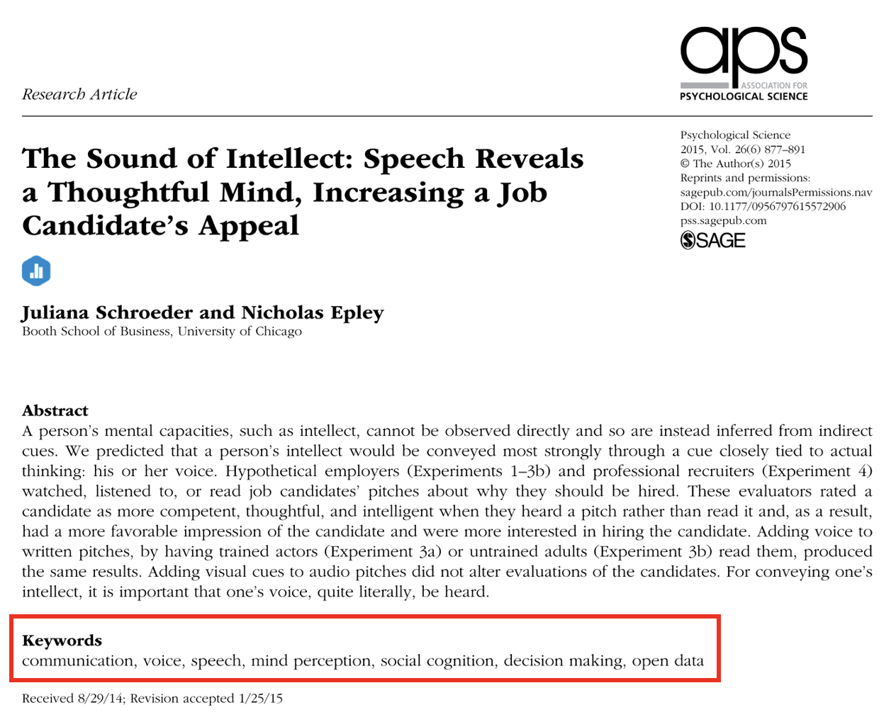
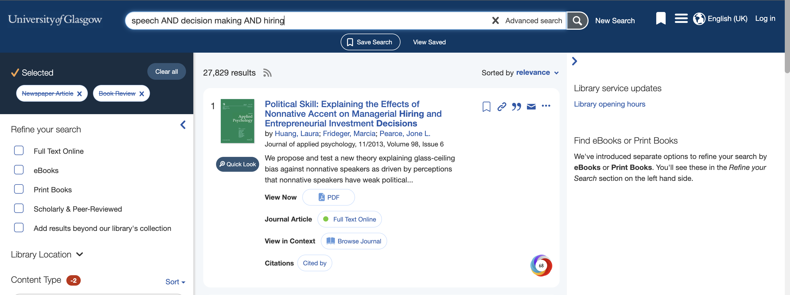
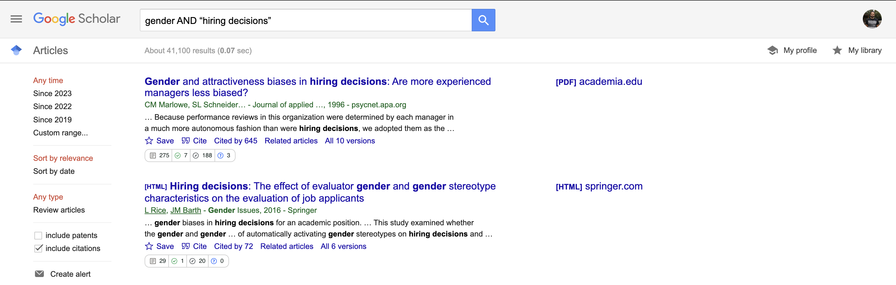
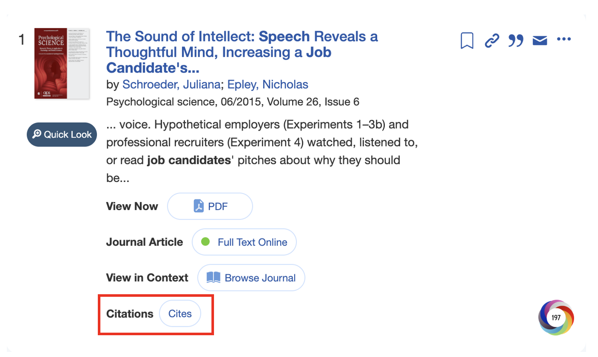
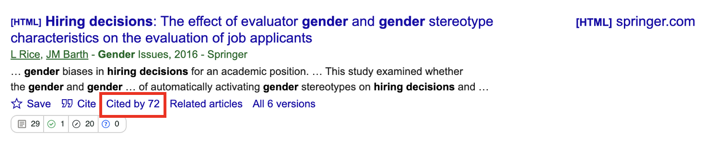

```{r, echo=FALSE}
source(file = "include/deadlines.R")

library(knitr)
library(tibble)

knitr::opts_chunk$set(echo = FALSE)
```

# Finding, Reading, and Organising Journal Articles {#Writing-02}

In this resource to support the week 2 lab and research skills, you work on finding journal articles and using a reference manager, reading empirical journal articles and identifying key information, and starting to organise your articles for assignments. 

## Finding journal articles

### Identifying key words

Before you can read journal articles, you need to find them. The first step in a literature review is working out what your keywords will be. You will be looking in data bases, so you need to select the appropriate terms to ensure your search results return the content you are looking for. It takes patience to identify and tweak the search terms that identify the content you are looking for. As a starting point, these might be your topic or variables. 

Once you identify some useful articles, these can provide further inspiration and specificity. Many journal articles will give you a helping hand as the authors have to provide several keywords relating to the article. For example, the following figure from [Schroeder and Epley (2015)](http://journals.sagepub.com/doi/10.1177/0956797615572906) highlights the keywords that describe their article. 

```{r keywords figure, fig.alt = "Screenshot of first page of Schroeder and Epley showing title, abstract, and keywords."}

```

The majority of articles will post keywords under the abstract. Here, we can see there are seven words or short phrases that summarise the content of the article. Sometimes they are not truly relevant to the topic (e.g., open data here), so you will need to skim a few articles to recognise recurring themes and potentially useful keywords. 

### Search strategies

Once you have some keywords, your next step will be to try and find more articles. The two main data bases you will use are the University of Glasgow library and Google Scholar. 

The University of Glasgow library can be accessed through your student portal. This is the database that the university uses to pay for access to journal articles and ebooks. Glasgow has a huge number of journals available, so this will be one of your best resources as you may be asked to pay for articles if you access journal websites directly, never pay for articles though, there is always a way to find them. Google Scholar is also a valuable resource that can return different results. A combination of these two databases will be a good starting point for any essay or report. 

::: {.dangerous data-latex=""}
Never pay for journal articles. We have a huge library at Glasgow, so you will almost always find the article by searching for the title. If it is not available, then there are other strategies like searching the title on Google Scholar or regular Google and there might be a PDF someone has posted. Authors can often freely share an author manuscript which contains the same text as the final article but without the fancy journal formatting.
:::

Enter your keywords in the search bar of these data bases. You can enter one word or phrase and the data base will try to locate resources that contain that word. For example, we might want to find additional articles investigating job candidates' speech. 

```{r single keyword figure, fig.alt = "Screenshot of the University of Glasgow library page to search for articles featuring job candidate speech."}
include_graphics("images/02-single-keyword.png")
```

However, it is usually much more powerful to combine search terms to provide more precise results. If you enter single words or phrases, you might find there are thousands of results which contain mostly irrelevant articles. You can use two or more keywords to look for more specific articles. 

```{r multiple keywords figure, fig.alt = "Screenshot of the University of Glasgow library page to search for articles using AND as a Boolean operator."}

```

Here, you can see we have used speech AND decision making AND hiring. The capitalised AND is called a [Boolean operator](https://www.gla.ac.uk/myglasgow/library/fulltextjournalarticles/searchforarticles/). It is used to link together the three words. It means we only want articles that contain the three words. Not one of them, not two of them, but all three. Using AND narrows down your search. Alternatively, you can use OR which expands your search to look for two or more terms. AND will provide fewer results and OR will provide more. You can also use NOT to rule out particular terms.

::: {.info data-latex=""}
You can do this in the single search bar by entering the Boolean operators yourself. Alternatively, if you click advanced search, you can add search boxes and choose from AND, OR, and NOT for each term. You can also start to filter your results to only return results from a date range, if you only wanted articles from say the past 5 years. 
:::

You can also use [Boolean operators in Google Scholar](https://southern.libguides.com/google/boolean) to combine the search terms gender AND “hiring decisions”. This means we only want search results that contain both elements. 

```{r Google Scholar figure, fig.alt = "Screenshot of using Boolean operators in Google Scholar."}

```

Hiring decisions is also surrounded by quotes. This forces databases to search for the specific phrase exactly as typed in the quotes. If we did not surround it by quotes, we can get search results that contain the words hiring and decisions separately or together. If they are separate, the results might not be quite what we are looking for. 

As a final literature searching tip, once you find an article that is precisely on the topic you are searching for, you can look at articles in its reference list, and at articles that have since cited it. This is no guarantee there will be something useful, but you can often benefit from the citation trees of your key articles. 

On the library portal, you can see articles that your target articles cites, which will show the articles in its reference list that are readable by the library data base.

```{r library cites figure, fig.alt = "Screenshot of identifying articles that a target article cites in the library portal."}

```

Alternatively, on Google Scholar, you can look through the articles that have since cited your target article. You will get fewer hits for more recent articles as there has been less time for another article to be published, but its another useful strategy for identifying potentially useful articles. 

```{r Scholar cited by figure, fig.alt = "Screenshot of identifying articles that have since cited your target article in Google Scholar."}

```

For further tips, see the University of Glasgow library guide on [how to search for articles](https://www.gla.ac.uk/myglasgow/library/fulltextjournalarticles/searchforarticles/) and [a brief video navigating around the library search function](https://youtu.be/Zy-VLyeLEAM?si=2nd01D-QoBOP2brL).

### Using a reference manager to store your results

Throughout the programme, you will need to use APA 7th edition. Although you could download each article and manually enter the citation and reference list entries, there are more efficient ways to provide you with more time in other areas of your report or essay writing. A reference manager will help to keep your research organised and it will do a lot of the heavy lifting when it comes to entering citations and creating the reference list. 

Our recommendation is Zotero which can be downloaded for free at https://www.zotero.org/. There are alternatives (such as EndNote which the university endorses as approved software), but most of the psychology team prefer Zotero. Under preferences, make sure you select APA 7th edition to format the citations and references correctly. 

```{r Zotero figure, fig.alt = "Zotero logo with red Z and black otero."}
include_graphics("images/02-Zotero.png")
```

::: {.warning data-latex=""}
As third-party software which requires you to create an account, we recommend not using the same password as your university account.  
:::

Using Zotero, you can:

- Install a plugin to save articles you find through your web browser 

- If there is an open access version of the article PDF, Zotero will automatically save it 

- Manually upload PDFs and Zotero will try to find the key metadata such as the title, volume number etc.

- Create folders to keep your research organised into folders, such as one for each assignment. 

- Create shared folders to add and access the same articles with people you are working with. 

- Copy citation and reference lists into your assignment. 

- Use the Zotero plugin in Word or Google Docs to enter citations and automatically create a reference list.

- Add notes and highlights to each article you read within Zotero. 

- Sync your library across devices, so you can download articles on your laptop, but read the articles on your tablet. 

Just keep in mind, Zotero cannot always find all the information or it gets some of the details wrong. So, you may have to manually enter/edit the details for the citation/reference to be formatted correctly. This is why it is still important to learn the key details of APA formatting, but you are using your understanding more efficiently to spot mistakes rather than manually format each entry in your assignment. 

If you like to follow along to a video, there are some helpful resources on YouTube to guide you through a lot of the basics: 

- McGill University has a [playlist of a short tutorials](https://youtube.com/playlist?list=PL4asXgsr6ek5H5mM9GlA1d-YCb9KvP3Ja&si=DNUP50Dhn_apDM-D). 

- There are also [longer tutorials working through the features](https://youtu.be/JG7Uq_JFDzE?si=S973FkGPMNgXyYkh) of Zotero.

The [Zotero website](https://www.zotero.org/support/) also has a quick start guide if you prefer a written explanation in addition to detailed documentation. 

## Reading journal articles 

Now you have one or two articles, the ability to read them might sound obvious, but research (e.g., [Kershaw et al., 2018](https://link.springer.com/article/10.1007/s11251-018-9456-2)) consistently shows students find it difficult at first to summarise and critically evaluate empirical research. Our students have a range of backgrounds, so we want to make sure everyone has the skills to read and evaluate published research.    

Journal articles have a different structure and writing style than textbooks or news articles. Usually, they are not written to be a thrilling bedtime read. They can be quite dense with lots of technical jargon. This means - particularly early in your degree - you have to be quite strategic in how you read journal articles. 

Until you learn about different statistical tests, the introduction and discussion sections will be most accessible. The introduction provides the background to the study and outlines what the study is trying to achieve. The discussion recaps what results the authors think they found and puts them in context. As you progress through your research methods courses, you will understand more of the method and results. 

### Types of Journal Article

Before we introduce the QALMRI method, it is important you recognise there are different types of journal article. The QALMRI method mainly applies to original quantitative research, so here is a list of common journal articles and types of research you may come across: 

- **Original research: quantitative studies**: Potentially the most common type of research in psychology. These articles contain an individual study or a series of studies where the researchers collect numeric data to answer their research question. This is what we will focus on for this tutorial. 

- **Original research: qualitative studies**: Some research follows a different methodological philosophy where they collect non-numerical data, such as identifying themes in forum posts. The QALMRI method would not totally apply here as qualitative research typically does not test hypotheses, but you would identify the authors' broad and specific research questions and their important results. 

- **Systematic reviews and/or meta-analyses**: Researchers may want to identify all the relevant articles on a topic and collate their findings. In a systematic review, the authors provide an overview of the findings in words. In a meta-analysis, the authors apply statistical techniques to calculate the average effect size across studies and how much the effect sizes vary.  

- **Review article**: Instead of trying to identify all relevant articles in a systematic review, a review is less comprehensive. Researchers typically write review articles to explain a topic to readers or outline a theory. 

- **Editorials**: Editors of a journal may write short introductions to a collection of articles they are publishing or announce a new policy for their journal.

- **Commentary or opinion articles**: Commentary or opinion articles allow authors to present their viewpoint on a topic, typically in response to another article. For example, if a set of authors disagree with the methods or interpretation of an original article, they can write a commentary or opinion article to explain why they disagree. 

### The QALMRI Method

One evidenced-based strategy to learn how to read journal articles containing original quantitative research is known as the QALMRI (Question, Alternatives, Logic, Method, Results, and Inferences) method ([Brosowsky et al., 2020](https://psyarxiv.com/p39sc/)). You can read more about the method on [Crump's (2018)](https://www.crumplab.com/ResearchMethodsLab/qalmri.html) Research Methods Lab Manual. When reading an article, try and answer the following questions: 

**Questions**

1. What was the broad question (the general topic of interest) being asked by this research project?

2. What was the specific question (what this specific experiment will address) being asked by this research project?

**Alternatives**

3. What was the author’s hypothesis (the hypothesis they are testing)?

4. What were the alternative hypotheses (what other explanations could there be that the authors ruled out)?

**Logic**

5. What was the logic of the hypothesis? i.e., if the hypothesis was true, what should we expect to happen?

**Methods**

6. Briefly describe the study design (i.e., experimental or correlational?) and sample.

7. What were the variables? i.e., independent and dependent variables for experiments; variables for correlations. 

8. Briefly describe the study procedure in everyday terms.

**Results**

9. What were the important results?

**Inferences**

10. What did the authors conclude from their study?

11. How did the authors use the results to make inferences and conclusions about the hypothesis and research question?

### The QALMRI Method in Action

The authors of the QALMRI method ([Brosowsky & Parshina, 2017](https://nbrosowsky.github.io/documents/QALMRI-instructions.pdf)) provide a worked example so you can see what information you must identify in a journal article. The following answers are reproduced from Brosowsky and Parshina with some minor edits. They evaluated the study "Ecological validity of the testing effect: The use of daily quizzes in introductory Psychology" by [Batsell et al. (2017)](http://journals.sagepub.com/doi/full/10.1177/0098628316677492):

#### Questions

1. What was the broad question (the general topic of interest) being asked by this research project? 

**What kinds of teaching techniques will improve student learning in a classroom?**

2. What was the specific question (what this specific experiment will address) being asked by this research project?

**Will daily quizzes enhance retention of assigned study material?**

#### Alternatives 

3. What was the author’s hypothesis (the hypothesis they are testing)?

**Hypothesis 1: Daily quizzes will improve memory for study material whether the material had appeared in a quiz or not.**

4. What were the alternative hypotheses (what other explanations could there be that the authors ruled out)?

**Hypothesis 2: Daily quizzes will only improve memory for study material that appeared in the quizzes.**

**Hypothesis 3: Daily quizzes will not improve memory for study material.**

#### Logic

5. What was the logic of the hypothesis? i.e., if the hypothesis was true, what should we expect to happen?

**If hypothesis 1, then a quizzed group will perform better than a study-only group on a memory test for all the studied material.**

**If hypothesis 2, then a quizzed group will perform better than a study-only group on a memory test, but only for the material that appeared on the tests.**

**If hypothesis 3, then a quizzed group will not perform better than a study-only group on a memory test for the studied material. Note: In essence, this is the null hypothesis of no difference.**

#### Methods

6. Briefly describe the study design (i.e., experimental or correlational?) and sample.

**The study used a 2x3 factorial design (quasi-experimental). The sample included 64 university students from a range of levels in the authors' department.**

7. What were the variables? i.e., independent and dependent variables for experiments; variables for correlations. 

**Independent Variable A: Class (study-only and quiz):**
- **One class received daily quizzes while the other did not.**

- **This variable is between-subjects and quasi-experimental (students were not randomly assigned to classes).**

**Independent Variable B: Question-Type (identical, similar, and new):**

- **Memory test questions were either identical to those used in the quizzes (identical), similar in content to those used in the quizzes (similar), or did not appear in the quizzes (new).**

- **This variable is within-subjects and experimental (questions were randomly assigned to each condition).**

**Dependent Variable: Accuracy averaged across three memory tests.**

8. Briefly describe the study procedure in everyday terms.

**Students enrolled in two Introduction to Psychology courses took part in the study. The participants were all assigned textbook readings which consisted of material not taught during the lectures. One class received daily quizzes (21 total), while the other did not. Memory was tested three times throughout the term using 15 multiple-choice questions. Test questions were either identical to the quiz questions (identical), similar in content to the quiz questions (similar), or questions that did not appear in the quizzes (new).**

#### Results

9. What were the important results?

**The Class x Question-Type ANOVA and follow-up t-tests show that the quiz group outperformed the study-only group on all three question types. However, this difference was greatest for identical questions (21.8%), then similar questions (17.6%), and smallest for new questions (12.7%).** 

**ANOVAs with follow-up t-tests were also run separately on the quiz and study-only groups. The results for the study group showed no significant differences in performance across the identical (58.4%), similar (62.8%), and new (60.4%) question types. The results for the quiz group however, showed that performance for the identical (80.2%) and similar (80.4%) questions was significantly better than performance for the new questions (73.1%).**

#### Inferences

10. What did the authors conclude from their study?

**The results of the experiment show enhanced retention of studied material when participants were quizzed daily regardless of whether the study material was actually presented during the quizzes or not.**

**The authors conclude that they successfully replicated the testing effect, previously shown in laboratory settings, in a naturalistic classroom setting. Furthermore, they conclude that the testing benefit generalizes to non-quizzed material and therefore instructors do not need to quiz all of the study material to gain the testing effect benefit.**

11. How did the authors use the results to make inferences and conclusions about the hypothesis and research question?

**These results are consistent with the original hypothesis (Hypothesis 1) and suggest that periodic quizzes can enhance the retention of assigned material (specific question) and testing could be used as an effective teaching technique to improve student learning in a classroom setting (big question).**

### Exercise: Applying the QALMRI Method 

Now you have read about the QALMRI method and saw how you can answer the 11 questions based on the information in a journal article, it is time to practice yourself on a new article. 

[Pieger et al. (2018)](https://www.frontiersin.org/articles/10.3389/feduc.2018.00101/full) is available open access through the journal *Frontiers in Education*. They studied the disfluency effect: the idea that writing information in a harder to read font requires greater concentration which can lead to improved recall when quizzed on the topic. Read through the article and try to answer the questions from the QALMRI method. The activity below is based on downloading the article as a PDF to see page numbers, but you could check your understanding of the QALMRI questions using either the web or PDF version. 

Each question has two elements: the page number that includes the information and a hidden solution providing a longer explanation. Make sure you attempt each question on your own first and then check you identified the correct information by looking at the solution. For the page number, you can keep track of how many you answered correct below:

`r total_correct(elem = "h3", args = "style='color:#003366;'")`

#### Questions

1. What was the broad question (the general topic of interest) being asked by this research project?

Page `r fitb(2)` best includes this information. 

`r hide("Check the solution")`

On the middle left of page 2, their broad question can best be described as "is disfluency a desirable difficulty and does it activate analytic monitoring?". 

`r unhide()`

2. What was the specific question (what this specific experiment will address) being asked by this research project? There are **two** research questions the authors are interested in here, but they are both on the same page. 

Page `r fitb(3)` best includes this information. 

`r hide("Check the solution")`

On the bottom right of page 3, their specific research questions are helpfully in the research questions sub-section. They are asking two questions: (1) does viewing disfluent then fluent test activiate analytic monitoring and (2) does viewing fluent then disfluent text activate surface level monitoring?  

`r unhide()`

#### Alternatives 

3. What was the author’s hypothesis (the hypothesis they are testing)?

Page `r fitb(3)` best includes this information. 

`r hide("Check the solution")`

On the bottom right of page 3, hypothesis 1: when participants view disfluent then fluent texts, they expect no difference between disfluent text and fluent text on their outcomes. 

`r unhide()`

4. What were the alternative hypotheses (what other explanations could there be that the authors ruled out)?

Page `r fitb(3)` best includes this information. 

`r hide("Check the solution")`

On the bottom right of page 3, hypothesis 2: when participants view fluent then disfluent texts, they expect the outcomes such as ease of learning to be lower for disfluent text than fluent text. Note: This is slightly different to the previous example. Pieger et al. (2018) did not outline competing hypotheses, they just outlined their predictions in two parts for each presentation order. 

`r unhide()`

#### Logic

5. What was the logic of the hypothesis? i.e., if the hypothesis was true, what should we expect to happen? There is no page number to identify here, you just need outline what results would support each hypothesis. 

`r hide("Check the solution")`

For hypothesis 1, there will be no difference in the dependent variables between disfluent text and fluent text when participants are shown the materials in the disfluent then fluent order. 

For hypothesis 2, the dependent variables will be lower for disfluent text than fluent text when participants are shown the materials in the fluent then disfluent order. 

`r unhide()`

#### Methods

6. Briefly describe the study design (i.e., experimental or correlational?) and sample.

Page `r fitb(4)` best includes this information. 

`r hide("Check the solution")`

On the left middle of page 4, the study is a 2x2 mixed design. Note: the authors do not specifically outline the design in shorthand, but they describe each independent variable. The sample included 65 university students from the authors' department.  

`r unhide()`

7. What were the variables? i.e., independent and dependent variables for experiments; variables for correlations. 

Page `r fitb(4)` best includes this information. 

`r hide("Check the solution")`

IV1 is between-subjects and includes the contrast group for which order they see the text. IV2 is within-subjects and includes both fluent and disfluent text conditions. The study has several dependent variables including ease of learning, prediction of performance, and actual memory performance. 

`r unhide()`

8. Briefly describe the study procedure in everyday terms. 

Pages `r fitb(4)` and `r fitb(5)` best include this information. There is also a diagram to help explain the procedure on page `r fitb(6)`. 

`r hide("Check the solution")`

For each fluent and disfluent text, participants briefly saw the text and completed the dependent variables related to the first monitoring judgments. For example, rating how confident they were about their performance. Then the participants studied the text for up to 15 minutes and completed the second monitoring judgments. Depending on IV1, they either read the disfluent text first or the fluent text first. When they finished reading both texts, they completed knowledge tests for both texts at the end. 

`r unhide()`

#### Results

9. What were the important results? There are several pages of results to cover each dependent variable, so for the purposes of this exercise, focus on the **performance** results. Did participants recall more information about the fluent or disfluent text? 

Page `r fitb(7)` best includes this information. 

`r hide("Check the solution")`

On the bottom left of page 7, performance is the last dependent variable they analyse before summarising all their results. There was a statistically significant main effect of fluency. This means if you ignore which contrast group they were allocated to, performance was higher for fluent text than disfluent text. Note: the authors also use something called Bayesian statistics which you may be less familiar with. 

`r unhide()`

#### Inferences

10. What did the authors conclude from their study?

Page `r fitb(7)` best includes this information. 

`r hide("Check the solution")`

On the top and middle of page 7, the authors recap their results at the start of the discussion. When the fluent text was presented first, participants use fluency as a cue for all learning judgements (e.g., ease of learning and prediction of performance). Participants rated these variables as lower for the disfluent text than for the fluent text. However, when the disfluent text was presented first, participants no longer use fluency as a cue for learning judgments and there was no significant difference between fluent and disfluent texts. 

`r unhide()`

11. How did the authors use the results to make inferences and conclusions about the hypothesis and research question?

Page `r fitb(7)` best includes this information. 

`r hide("Check the solution")`

On the top and middle of page 7, the authors concluded their results support both hypothesis 1 and hypothesis 2. Hypothesis 1 predicted there would be no difference in learning judgments when participants read the disfluent then the fluent text. Hypothesis 2 predicted learning judgments would be lower for the disfluent text when participants read the fluent then the disfluent text. 

`r unhide()`

### Organising journal articles 

The QALMRI method applies to individual journal articles, but in your assignments, we expect you to read several articles to build a literature review. You can take the QALMRI method and create a table using something like Word or Excel to collate the articles you read. For example: 

```{r QALMRI table, echo = FALSE}

table <- tribble(
  ~ "Citation", ~ "Question", ~ "Alternative", ~ "Logic", ~ "Methods", ~ "Results", ~ "Inference", 
  "Batsell et al. (2016)","1. What kinds of teaching techniques will...","3. Hypothesis 1: Daily quizzes will improve memory...","5. If hypothesis 1, then a quizzed group will...","6. The study used a 2x3 factorial design...","9. The Class x Question-Type ANOVA...","10. The results of the experiment show...",
  "Pieger et al. (2018)", "1. Is disfluency a desirable difficulty...","3. Hypothesis 1: When participants view disfluent...","5. For hypothesis 1, there will be no difference...","6. The study is a 2x2 mixed design...","9. There was a statistically significant main effect of fluency...","10. When the fluent text was presented first..."
)

kable(table)

```

Each row can be one article you read and you can group each section of the QALMRI method as separate columns. As you build your literature review, you can see similarities and differences across the studies. You also have prompts for critical evaluation where you can comment on features like the sample and sample size. Organising your notes like this will help you stay organised as its unlikely you will remember every key feature of the 10th or 20th article. 

In addition, you might find these blog posts by Dr. Raul Pacheco-Vega - a political scientist - helpful when thinking about how you can approach a literature review and keep your reading organised:

- [How to undertake a literature review](http://www.raulpacheco.org/2017/04/how-to-undertake-a-literature-review/): This post talks about how you can approach searching for literature in a new area or in your case, a new assignment. 

- [Synthesizing different bodies of work in your literature review](http://www.raulpacheco.org/2016/06/synthesizing-different-bodies-of-work-in-your-literature-review-the-conceptual-synthesis-excel-dump-technique/): This post demonstrates Raul’s approach to recording the results of a literature review. You might find it helpful for structuring your own approach. Just keep in mind as a political scientist, there is a lot of emphasis on quotes which we do not tend to use in psychology. 

### Summary and Additional Resources

Like any skill, learning how to recognise the key information in journal articles takes time and practice. Journal articles are typically written for expert audiences, so they may not specifically label key information you are looking for. For example, in the exercise above, Pieger et al. did not say they used a 2x2 mixed design. You had to recognise the information in the main text and piece it together. As you read more journal articles, you will get quicker at recognising this information, allowing you to focus more time on reading the article critically than simply understanding it. 

If you would like additional tips and resources on reading journal articles, you might find the following articles useful: 

- This short blog by [Raff (2016)](https://blogs.lse.ac.uk/impactofsocialsciences/2016/05/09/how-to-read-and-understand-a-scientific-paper-a-guide-for-non-scientists/) aims to explain journal articles to non-scientists, so it should provide an accessible introduction. 

- This short article by [Pain (2016)](https://www.science.org/careers/2016/03/how-seriously-read-scientific-paper) has quotes from several high-profile researchers where they explain how they approach reading a scientific paper.

- This long article by [Carey et al. (2020)](https://journals.plos.org/ploscompbiol/article?id=10.1371/journal.pcbi.1008032) discusses how to approach reading a journal article for different purposes by presenting 10 rules to follow. 
