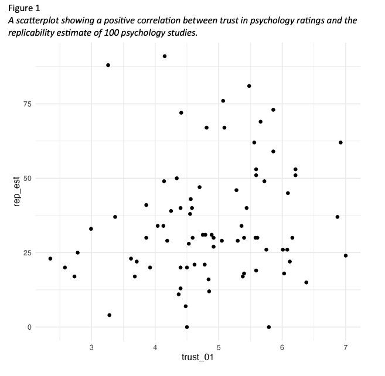
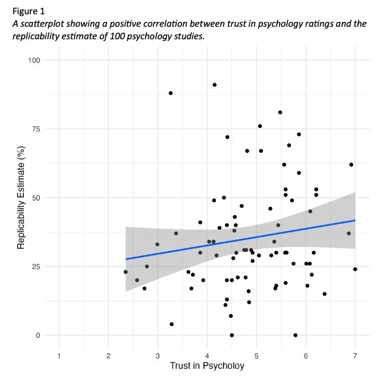

# Week 7

## Lab overview

After a hopefully refreshing reading week, we are back to the labs and looking more towards your stage two individual report. You can still ask questions about the stage one group report and some content might be useful to feed into it. However, the idea was to give you the key content you need for the stage one report prior to reading week, and the key content for the stage two report after reading week. 

We organised the next two weeks similar to work through the structure of the results section, but with this week focused on reporting correlations, and next week focused on reporting t-tests. 

This week, you will also learn about what information to report in a power analysis. Keep in mind this is more going above and beyond as you would typically find it in a method section, but because of the course schedule, we cannot fit it in until week 8 and 9 when your stage one report is due. If you do want to report a power analysis in your stage one report, then the first part of the research skills chapter works through it. 

After reading about the structure of the results section applied to correlations, we have a task for you to compare different versions of a results section. This requires you to understand what information should be reported and recognise what information is present, absent, or inaccurate. The versions can be ranked to identify the best example, but even the best one can be improved. So, your task will be to rank the versions based on their strengths and weaknesses, then discuss what could be improved about the best one. 

## Tasks to complete prior to your lab

1. Read through the [Reporting Power Analyses and Correlation Results](#Results1) chapter.

2. Read through the [task context and comparison](#C7-task) section below to judge different attempts at writing up a correlation. 

## Tasks to complete after attending your lab

1. Reflect on what you learnt in the correlation results comparison task to feed into your own results section in the stage two individual report. 

2. Work on drafting and editing your introduction and method for the stage one group report. 

## Next week

We will continue with the structure of results sections, but this time, focus on reporting the results of a t-test. Many of the lessons from this week still apply, but there are subtle differences like discussing effect sizes as differences rather than relationships, and which visualisations are more appropriate. 

We will also cover data visualisation more generally, like APA formatting guidance for tables and figures, and what we are trying to achieve with data visualisation. 

## Task context and comparison{#C7-task}

We have five different write-ups of the same results and we would like you to read through them and decide a) what is the order of best to worst, and b) how would you improve the best one? You can do this task yourself or in a group. The key to this task is thinking about the comparison between the versions, so be sure to actively make notes on what made one version better than another. 

To help you think about your decision, here are some of the elements that we tend to look at when we evaluate results sections:

**Knowledge and Research**: Has the person understood the purpose of a results section, that they know about assumptions for tests, and that they understand the relationship between the design and analysis? This means judging whether they have picked appropriate visualisation, descriptive statistics, and inferential statistics.

**Critical Evaluation**: Has the person summarised their inferences for the section without going into theoretical or practical implications which should be kept to the discussion? Usually, we just include a sentence or two at the end that draws things together, saying if there was a significant or non-significant effect and interprets the direction and size of any effect for the reader.

**Academic Communication**: Has the person followed common conventions in presenting results? For instance, using APA notation for statistics, and including appropriate figures and tables. 

### Task context

This study attempted to replicate the findings of [Wingen et al. (2020)](https://doi.org/10.1177/1948550619877412) by investigating the correlation between trust in psychology and the replicability of research findings. The primary objective was to determine if a positive correlation - like the one observed in the original study - existed. We recruited 80 participants who completed two key measures.

The first measure was a 1-7 scale consisting of 5 items designed to assess participants' level of trust in the field of psychology. This scale aimed to gauge their overall confidence in the reliability and validity of psychological research. We then took the mean of the 5 items, where higher values mean greater trust. 

The second measure involved participants estimating the percentage of findings from a set of 100 studies that would successfully replicate, from the [Open Science Collaboration (2015)](https://www.science.org/doi/10.1126/science.aac4716). This aspect of the study aimed to assess participants' perceptions of the field's ability to replicate research results.

The study was conducted as a replication effort to investigate if greater trust in the field of psychology would be associated with higher expectations of replicability. Our hypothesis was there would be a positive correlation between trust in psychology and estimates of replicability.

Your task is to read these five versions and after considering their strengths and weaknesses: a) rank them from the best to the worst examples and b) think about what you would change to improve the best one. 

### Sections to compare

If it would help to make notes on a Word version, you can [download the context description and five versions](Supporting/07_correlation_comparison.docx). 

#### Version 1 

A Pearson’s correlation found there was a non-significant small positive correlation between trust in psychology and estimates of replicability, *r*(78) = .16, *p* = .085, 95% CI = [-.03, 1.00]. 

#### Version 2 

We hypothesised that there is a positive correlation between trust in psychology and estimates of replicability. The mean rating for trust in psychology was 4.86 (*SD* = 1.02) and the mean replicability estimate was 35.24 (*SD* = 19.91). Figure 1 provides a scatterplot for the relationship between trust in psychology and estimates of replicability. 

We checked outliers and there were no extreme values in the sample. Data met the assumption of normality and homoscedasticity. Although the trust in psychology scale could be interpreted as ordinal, we treated it as interval data after calculating the mean of five items. 

We applied a one-tailed Pearson’s correlation test as we predicted a positive correlation and we found there was a non-significant small positive correlation between trust in psychology and estimates of replicability, *r*(78) = .16, *p* = .085, 95% CI = [-.03, 1.00]. 

We predicted a positive correlation between trust in psychology and estimates of replicability, but we did not support our hypothesis as the one-tailed Pearson’s correlation was not statistically significant. 

#### Version 3 

We hypothesised that there is a positive correlation between trust in psychology and estimates of replicability. The mean rating for trust in psychology was 4.86. The *SD* rating for trust in psychology was 1.02. The mean replicability estimate was 35.24. The *SD* replicability estimate was 19.91. Figure 1 provides a scatterplot for the relationship between trust in psychology and estimates of replicability. 

We used a Pearson’s correlation test. There were 78 degrees of freedom and the *t*-value was 1.39. The value for r was 0.16. The *p*-value was 0.08 and the confidence interval ranged from -0.03 to 1.00. 

We predicted a positive correlation between trust in psychology and estimates of replicability, but we did not support our hypothesis.

#### Version 4 

We checked outliers and there were no extreme values in the sample. Data met the assumption of normality and homoscedasticity. Although the trust in psychology scale could be interpreted as ordinal, we treated it as interval data after calculating the mean of five items. 

The mean rating for trust in psychology was 4.86075 (*SD* = 1.01855) and the mean replicability estimate was 35.2375 (*SD* = 19.91199). 

We applied a one-tailed Pearson’s correlation test as we predicted a positive correlation and we found there was a non-significant small positive correlation between trust in psychology and estimates of replicability, *r*(78) = .15509, *p* = .08477, 95% CI = [-.03108, 1.0000]. 

We predicted a positive correlation between trust in psychology and estimates of replicability, but we did not support our hypothesis as the one-tailed Pearson’s correlation was not statistically significant. 

#### Version 5 

We hypothesised that greater trust in psychology would lead to higher estimates of replicability. The mean rating for trust in psychology was 4.86 (*SD* = 1.02) and the mean replicability estimate was 35.24 (*SD* = 19.91). Figure 1 provides a scatterplot for the relationship between trust in psychology and estimates of replicability. 

We checked outliers and there were no extreme values in the sample. Data met the assumption of normality and homoscedasticity. Although the trust in psychology scale could be interpreted as ordinal, we treated it as interval data after calculating the mean of five items. 

We applied a one-tailed Pearson’s correlation test as we predicted a positive correlation and we found a marginally significant small positive correlation between trust in psychology and estimates of replicability, *r*(78) = .16, *p* = .085, 95% CI = [-.03, 1.00]. 

We predicted greater trust in psychology would lead to higher estimates of replicability and the marginally significant positive correlation somewhat supports our hypothesis. 

