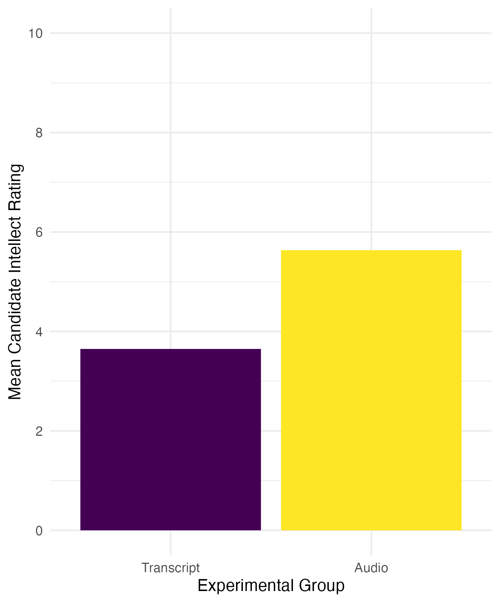
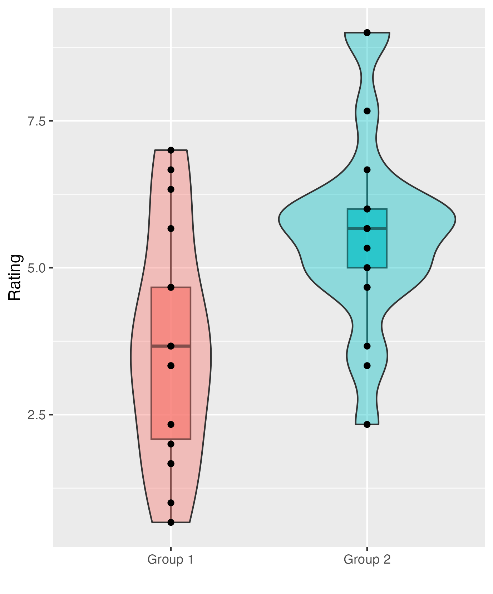

# Week 8

## Lab overview

This week is the second part of breaking down the results section. Last week, we focused on reporting the results of a correlation, and this week will cover reporting the results of a t-test. The structure is almost identical for the five to six key components, but there are some subtle differences in what you would report for a t-test compared to what you would report for a correlation.

This week, we will also spend a little time on data visualisation, either through plots or tables. We will cover some key APA style elements for formatting plots and tables, and highlight some principles to keep in mind when visualising data. 

After reading about the structure of the results section applied to t-test, we have another task for you to compare different versions of a results section. This requires you to understand what information should be reported and recognise what information is present, absent, or inaccurate. The versions can be ranked to identify the best example, but even the best one can be improved. So, your task will be to rank the versions based on their strengths and weaknesses, then discuss what could be improved about the best one in the lab. 

## Tasks to complete prior to your lab

1. Read through the [data visualisation and t-test results chapter](#visualisation-results).

2. Read through the [task context and comparison](#C8-task) section below to judge different attempts at writing up a t-test. 

## Tasks to complete after attending your lab

1. Reflect on what you learnt in the t-test results comparison task to feed into your own results section in the stage two individual report. 

2. Final editing of your stage one report to submit prior to the deadline. 

## Next week

Next week, you will have submitted your stage one group report, so it will be time to focus on the stage two individual report. Now you have your plan, you will be able to analyse the full data set to see what it means for your research question and hypothesis (if you have one). So, the first part of week 9 will be dedicated to thinking about the data processing pipeline for the full data set. The second part of week 9 will outline the structure of the discussion section. 

## Task context and comparison{#C8-task}

We have five different write-ups of the same results and we would like you to read through them and decide a) what is the order of best to worst, and b) how would you improve the best one? You can do this task yourself or in a group. The key to this task is thinking about the comparison between the versions, so be sure to actively make notes on what made one version better than another. 

To help you think about your decision, here are some of the elements that we tend to look at when we evaluate results sections:

**Knowledge and Research**: Has the person understood the purpose of a results section, that they know about assumptions for tests, and that they understand the relationship between the design and analysis? This means judging whether they have picked appropriate visualisation, descriptive statistics, and inferential statistics.

**Critical Evaluation**: Has the person summarised their inferences for the section without going into theoretical or practical implications which should be kept to the discussion? Usually, we just include a sentence or two at the end that draws things together, saying if there was a significant or non-significant effect and interprets the direction and size of any effect for the reader.

**Academic Communication**: Has the person followed common conventions in presenting results? For instance, using APA notation for statistics, and including appropriate figures and tables. 

### Task context

For this task, we will use data from [Schroeder and Epley (2015)](https://journals.sagepub.com/doi/10.1177/0956797615572906), which we have also used in the t-test data skills chapter. The aim of the study was to investigate whether delivering a short speech to a potential employer would be more effective at landing you a job than writing the speech down and the employer reading it themselves. Thirty-nine professional recruiters were randomly assigned to receive a job application speech as either a transcript for them to read, or an audio recording of the applicant reading the speech.

The recruiters then rated the applicants on perceived intellect, their impression of the applicant, and whether they would recommend hiring the candidate. All ratings were originally on a Likert scale ranging from 0 (low intellect, impression etc.) to 10 (high impression, recommendation etc.), with the final value representing the mean across several items. 

This means we have a between-subjects design with one independent variable containing two levels: an audio group and a transcript group. It is an experiment as recruiters were randomly allocated to one group or another. There was one dependent variable for the mean intellect rating of a candidate interviewing for a position. 

The research question was: Would there be a difference in the perceived intellect of candidates depending on if a recruiter reads the transcript of a job interview compared to if a recruiter listens to an audio recording of a job interview? 

The hypothesis was: Recruiters who heard an audio recording of a job interview would rate a candidate as higher in perceived intellect compared to recruiters who read a transcript of a job interview. 

Your task is to read these five versions and after considering their strengths and weaknesses: a) rank them from the best to the worst examples and b) think about what you would change to improve the best one. 

### Sections to compare

If it would help to make notes on a Word version, you can [download the context description and five versions](Supporting/08_ttest_comparison.docx). 

#### Version 1 

We hypothesised that the recruiters in the audio group would provide a higher candidate intellect rating than recruiters in the transcript group. The mean candidate intellect rating was 5.63 (*SD* = 1.91) in the audio group and the mean rating in the transcript group was 3.65 (*SD* = 1.61). Figure 1 provides a violin-boxplot showing the difference between the two groups. 

Figure 1

*A violin-boxplot showing higher candidate intellect ratings in the audio group compared to the transcript group.*

When checking outliers, there were four participants in the audio group with ratings outside the boxplot limits, meaning they were more than ± 1.5 times the interquartile range. However, given the 0-10 bounded scale, we did not consider them as outliers and retained them in the analysis. Data met the assumption of normality, and we used Welch’s t-test which Delacre et al. (2017) recommend using as default as it does not assume homogeneity of variance.

A two-tailed Welch’s t-test showed recruiters who listened to an audio recording rated the candidate's intellect as significantly higher than recruiters who read a transcript, *t* (33.43) = 3.48, *p* = .001. Our results support our hypothesis that recruiters who heard an audio recording of a job interview would rate a candidate as higher in perceived intellect compared to recruiters who read a transcript of a job interview. 

#### Version 2

We hypothesised that the recruiters in the audio group would provide a higher candidate intellect rating than recruiters in the transcript group. The mean candidate intellect rating was 5.63 (*SD* = 1.91) in the audio group and the mean rating in the transcript group was 3.65 (*SD* = 1.61). Figure 1 provides a violin-boxplot showing the difference between the two groups. 

Figure 1

*A bar plot showing higher candidate intellect ratings in the audio group compared to the transcript group.*

When checking outliers, there were four participants in the audio group with ratings outside the boxplot limits (see Appendix B1 for boxplots), meaning they were more than ± 1.5 times the interquartile range. However, given the 0-10 bounded scale, we did not consider them as outliers and retained them in the analysis. Data met the assumption of normality (see Appendix B2 for qq plots), and we used Welch’s t-test which Delacre et al. (2017) recommend using as default as it does not assume homogeneity of variance.

We found recruiters who listened to an audio recording rated the candidate's intellect as 1.99 units higher (95% CI = [0.83, 3.15]) than recruiters who read a transcript, where a two-tailed Welch's t-test was statistically significant, t (33.43) = 3.48, p = .001, Cohen's d = 1.12, 95% CI = [0.43, 1.81]. 

Our results support our hypothesis that recruiters who heard an audio recording of a job interview would rate a candidate as higher in perceived intellect compared to recruiters who read a transcript of a job interview. 

#### Version 3

We hypothesised that the recruiters in the audio group would provide a higher candidate intellect rating than recruiters in the transcript group. The mean candidate intellect rating was 5.63 (*SD* = 1.91) in the audio group and the mean rating in the transcript group was 3.65 (*SD* = 1.61). Table 1 provides a table of descriptive statistics for the two groups. 

When checking outliers, there were four participants in the audio group with ratings outside the boxplot limits (see Appendix B1 for boxplots), meaning they were more than ± 1.5 times the interquartile range. However, given the 0-10 bounded scale, we did not consider them as outliers and retained them in the analysis. Data met the assumption of normality (see Appendix B2 for qq plots), and we used Welch’s t-test which Delacre et al. (2017) recommend using as default as it does not assume homogeneity of variance.

We found recruiters who listened to an audio recording rated the candidate's intellect as 1.99 units higher (95% CI = [0.83, 3.15]) than recruiters who read a transcript, where a two-tailed Welch's t-test was statistically significant, *t* (33.43) = 3.48, *p* = .001, Cohen's d = 1.12, 95% CI = [0.43, 1.81]. 

Our results support our hypothesis that recruiters who heard an audio recording of a job interview would rate a candidate as higher in perceived intellect compared to recruiters who read a transcript of a job interview. 

#### Version 4

We hypothesised that the recruiters in the audio group would provide a higher candidate intellect rating than recruiters in the transcript group. The mean candidate intellect rating was 5.63 (*SD* = 1.91) in the audio group and the mean rating in the transcript group was 3.65 (*SD* = 1.61). Figure 1 provides a violin-boxplot showing the difference between the two groups. 

Figure 1

*A violin-boxplot showing higher candidate intellect ratings in the audio group compared to the transcript group.*

When checking outliers, there were four participants in the audio group with ratings outside the boxplot limits, meaning they were more than ± 1.5 times the interquartile range. However, given the 0-10 bounded scale, we did not consider them as outliers and retained them in the analysis. Data met the assumption of normality (see Appendix B1 for qq plots), and we used Welch’s t-test which Delacre et al. (2017) recommend using as default as it does not assume homogeneity of variance.

We found recruiters who listened to an audio recording rated the candidate's intellect as 1.99 units higher (95% CI = [0.83, 3.15]) than recruiters who read a transcript, where a two-tailed Welch's t-test was statistically significant, *t* (33.43) = 3.48, *p* = .001, Cohen's d = 1.12, 95% CI = [0.43, 1.81]. 

Our results support our hypothesis that recruiters who heard an audio recording of a job interview would rate a candidate as higher in perceived intellect compared to recruiters who read a transcript of a job interview. 

#### Version 5 

The mean candidate intellect rating was 5.634921 (*SD* = 1.911343) in the audio group and the mean rating in the transcript group was 3.648148 (*SD* = 1.608674). Figure 1 provides a violin-boxplot showing the difference between the two groups. 

Figure 1

The data met all parametric assumptions. We found recruiters who listened to an audio recording rated the candidate's intellect as significantly higher than recruiters who read a transcript, *t* (33.434) = 3.4787, *p* = .001421, Cohen's d = 1.124693, 95% CI = [0.4293182, 1.805776].
