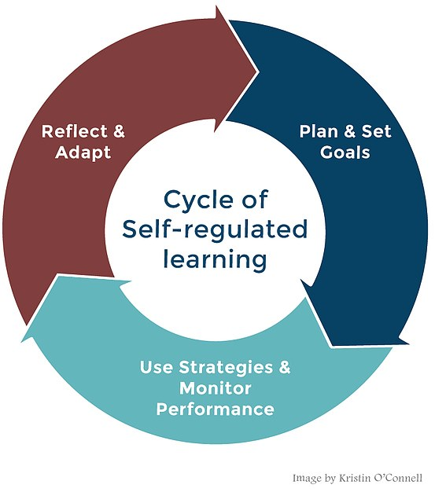

# Registered Report and MSLQ Overview

## General overview of the registered report

In this course, we are preparing you to read and appraise journal articles, and write up an empirical quantitative research project yourself. Throughout the lectures, labs, and independent learning, you will learn how to formulate a research question, design a study, apply statistical analyses, and write up your results to communicate to others as a research report.

In your group, you decide on a topic and collectively write a stage one registered report ([see the stage one AIS](#stage1-AIS)) which contains an introduction and method section for what you plan on studying. Individually, you will then write a stage two registered report ([see the stage two AIS](#stage2-AIS)) which contains a results, discussion, and abstract section.

You will be working with a secondary data set that we collected over the past few years. We have data from a few thousand students and you will be able to use the data to address a research question you develop in your group, within the parameters of the variables we have available. The rest of this chapter outlines the data set you will be working with in more detail, so please read through in advance of your first lab. 

## Research project topic

### MSLQ

The broad topic of the research project is **self-regulated learning**. 

Self-regulated learning models describe learning in terms of taking control of and evaluating one's own learning and behaviour. The study you will write up uses a questionnaire called the Motivated Strategies for Learning Questionnaire (MSLQ, Pintrich et al., 1991).

The MSLQ has two sections, motivation and learning strategies, each with multiple sub-scales. One of these scales may form part of the analysis you write up. There is more information about what each of these scales measures in the MSLQ Overview document, which you can [download using this link](Supporting/MSLQ Overview.docx), or you can find it on the Week 1 Moodle page.

**Motivation sub-scales**

- Intrinsic goal orientation

- Extrinsic goal orientation

- Task value

- Control beliefs

- Self-efficacy

- Test anxiety

**Learning strategy sub-scales**

- Rehearsal

- Elaboration

- Organisation

- Critical thinking

- Meta-cognition

- Time and study environment

- Effort regulation

- Peer learning

- Help-seeking

### Demographic variables

In addition to the MSLQ, we also have a selection of demographic information about the participants and you may choose to use one of these variables in your analysis, or use it to isolate a particular population of interest.

- Age in years

- Gender (male/female/non-binary)

- Native vs non-native speakers

- Paid employment in hours

- Living at home vs. living in halls

- Level of study (undergraduate vs. postgraduate)

- Mature student vs traditional student (for undergraduate students only)

## Potential Research Questions

You are going to conduct one of two types of statistical analyses in your study and it is up to you and your group to decide which one. You will conduct either a **correlation** or a **t-test** analysis. These answer different questions:

- Correlations assess whether there is a relationship between two variables

- t-tests assess whether there is a difference between two groups

Do not worry about exactly what the statistical analyses mean for now, we will cover this throughout the course! To help you understand a little more, if you are thinking about which sub-scales might be correlated with each other or related, you might ask such research questions as: 

1. Is help-seeking and test anxiety related? Are students who are more likely to seek help, less likely to be anxious about their assessments?

2. Is intrinsic goal orientation and effort regulation related? Are students who engage in learning for the challenge and to learn something new (rather than just to get good grades/pass the test) better at studying consistently throughout the semester and completing their goals?

If you are thinking about which sub-scales might show group differences, you might ask such research questions as:

1. Do mature students have lower test anxiety than traditional students?

2. Do postgraduate students have higher intrinsic motivation than undergraduate students?

We will go into more detail about how to create formal research questions and hypotheses in future weeks. Starting in week 2, we will show you how to find peer-reviewed evidence to build your understanding of the variables, identify a rationale, and develop your research question and hypothesis.

::: {.warning data-latex=""}
Your write up must contain a correlation analysis or a t-test analysis and so your research question, and ultimately your hypothesis, must be able to be answered by one of those approaches. 
:::

## MSLQ suggested variable pairs

Now you have an understanding of what the MSLQ project is, we have a list of variable pairs that have worked well in the past and we know that there is some existing literature to base your study on. We would like you to read through these pairs for different types of designs and analyses you will learn about in the semester. When you complete the group allocation spreadsheet, you will put your name down next to the pair you are most interested in, and we will use this to organise people into groups with similar interests. 

::: {.info data-latex=""}
**Can I still change my mind?** This seems like a big decision to make so early, but we use your initial interests to arrange people into groups when you might not know other people in your lab yet. You can choose different variables once you are in your groups, but we outlined these as we know they can work well together for the report, and you must make any changes in collaboration with all the members of your group. Once you settle on two variables, you might also focus on a specific population in your group as you develop your rationale, like focusing on postgraduate students if you recognise there is a gap in the literature, so there is still creative freedom beyond choosing the variable pairs. 
:::

### **t-test** for comparing two categories

- Test anxiety and undergraduate / postgraduate

- Help-seeking and first/second language 

- Metacognitive self-regulation and first/second language

- Metacognitive self-regulation and mature student status

- Metacognitive self-regulation and undergraduate/postgraduate study

- Extrinsic motivation and mature student status

- Self-efficacy and undergraduate/postgraduate study

- Extrinsic motivation and undergraduate/postgraduate study

- Intrinsic motivation and undergraduate/postgraduate study

### **Correlation** for the association between two variables. 

- Self-efficacy and help-seeking

- Test anxiety and employment hours

- Test anxiety and metacognitive self-regulation

- Test anxiety and self-efficacy 

- Self-efficacy and help-seeking

- Self-efficacy and employment

- Intrinsic motivation and age

- Extrinsic motivation and age

### **Wild card** for two different variables. 

- If you want complete freedom from the start to choose your own two variables, you can put your name next to the wild card slot. 

::: {.try data-latex=""}
Now you have read through the MSLQ and project overview, think about which variable pairs interest you the most and put your name down next to the pair that you want to start exploring on the group allocation document (available on Moodle). We will start putting you in groups in week 2 so you have as much time as possible to work on your group project. 
:::
