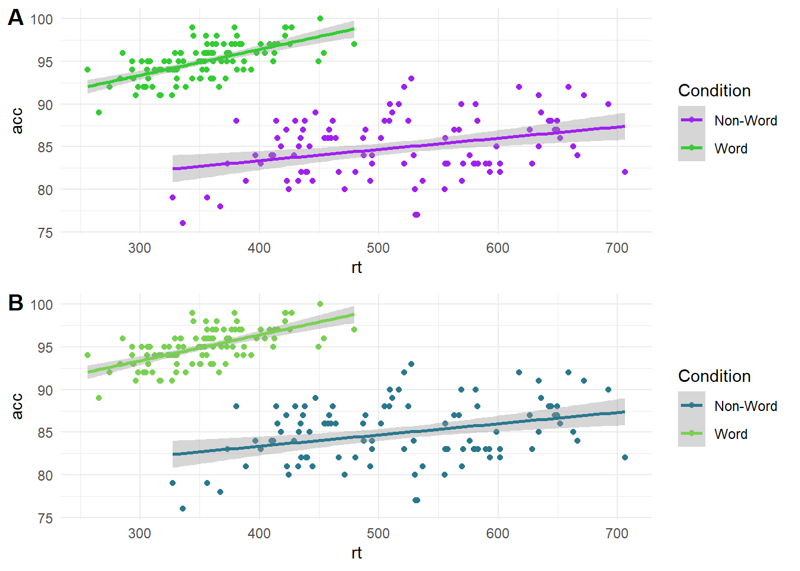
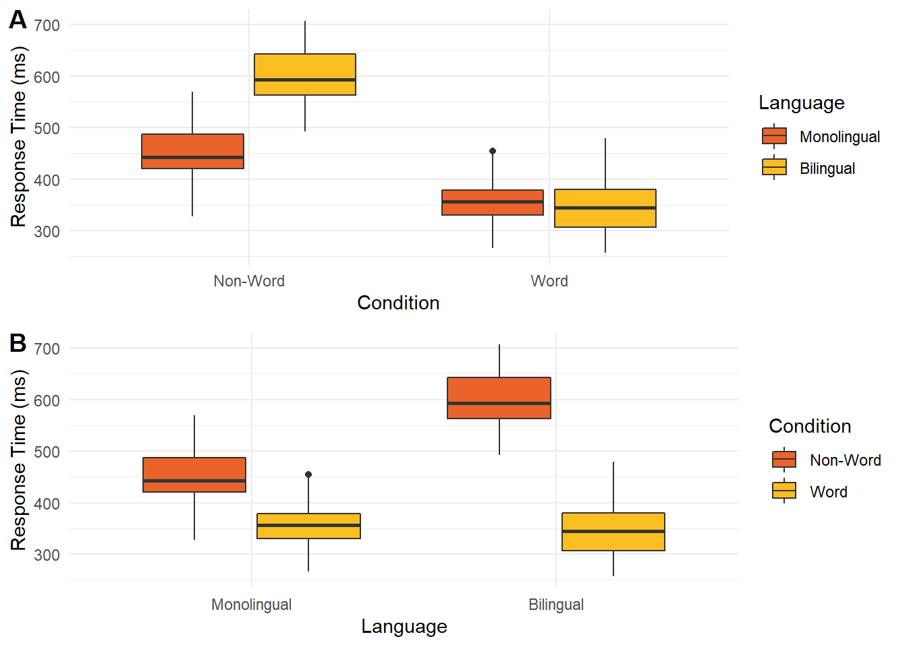
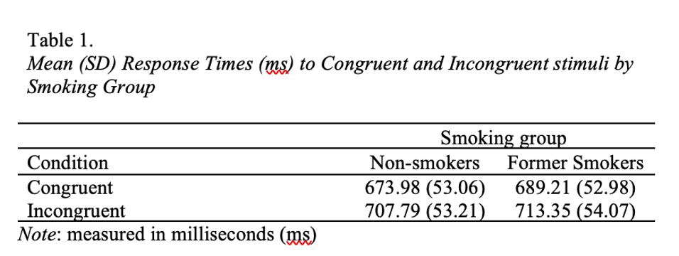
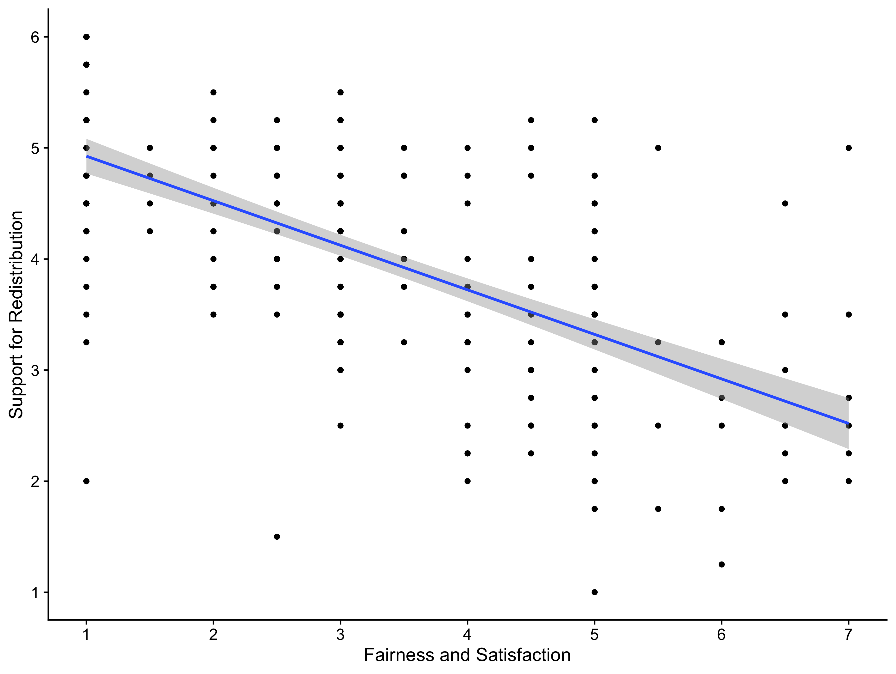

# Data Visualisation and Reporting t-test Results{#visualisation-results}

In this research skills chapter, we have two further topics to cover. The first is about [the role of data visualisation and formatting](#data-viz). We will explore why data visualisation is useful for both you and your reader, but how it is important to consider which types of visualisation transparently and effectively communicate your message. We will also cover some key APA formatting points for presenting tables and figures. The second topic is [structure of the results section part two](#structure-results), where this time we are focusing on reporting t-tests. 

## The role of data visualisation and formatting {#data-viz}

First, data visualisation is important for you as the researcher. Exploratory data analysis should be the first step in your data analysis toolkit to see what your data look like, check for potential problems, and identify initial patterns. 

To demonstrate why this is important, [the dinosaur dozen](https://www.research.autodesk.com/publications/same-stats-different-graphs/) shows how the same summary statistics (e.g., mean and standard deviation) can be identical but result from dramatically different data patterns. For example, creating a graph of a star, a cross, and yes, even a dinosaur can have the same underlying mean, standard deviation, and correlation. [Yanai and Lercher (2020)](https://doi.org/10.1186/s13059-020-02133-w) found that students would not recognise an image of a gorilla recreated as data points when they were focused on rushing to apply a statistical test. Therefore, exploratory data analysis is important in the initial steps of data analysis to check what patterns are present and if the data properties are consistent with what you expect. 

Second, data visualisation is important for your reader. Visualisations can communicate your message more effectively than a written summary or a wall of number, but it is crucial to balance efficiency with transparency. It can be easy to confuse or mislead people with poorly designed visualisations. 

### Data visualisation principles

Effective (or misleading) data visualisation is a whole field of study, so we will just outline a few key principles to keep in mind when designing your plots to help communicate your data as effectively and honestly as possible. If this is something that interests you, we recommend chapter one - looking at data - from [Data Visualisation](https://socviz.co/index.html#preface) by Healy (2018) and the comprehensive review article [The Science of Visual Data Communication: What Works](https://doi.org/10.1177/15291006211051956) by Franconeri et al. (2021) for further reading. 

#### Visual illusions 

Your visual system is pretty powerful and allows you to rapidly search for patterns in visual information. But for the same reasons that make graphs effective at communicating information, design features can also play tricks on the visual system and create illusions.

**Within the bar bias**

Bar plots are extremely common to see in journal articles and the media as they are easy to interpret. They are designed to communicate frequencies or percentages of observations where the top of each bar corresponds to the frequency of each variable or level you are plotting. Bar plots visualise frequencies well but they should not be used to summarise averages of continuous data, such as the mean of different groups. As the height of the bar only corresponds with the value of the mean, it hides other information like the distribution of observations behind the mean, and perception research shows people mistakenly think values within the bars are more likely than values outside the bars. 

For example, the bars in A below look identical when you just plot the means, but if you superimpose the data points in B, it shows a very different underlying pattern. This shows why it is important to consider what type of plot would effectively communicate the data you are working with and it is best to use something like a violin-boxplot for continuous outcomes. 

**Y-axis truncation**

One of the most powerful and most common illusions that can mislead people is truncated or non-zero axes, where (typically) the y-axis is shortened to zoom in on a smaller range of values. Franconeri et al. (2021) discuss studies that show people overestimate differences between two groups when you tell them the truncation is present and even if you get people to manually enter the values from each bar. For example, the bar plot below shows the same difference across the full 0 to 100 scale (A), then truncated between 45 and 60 to highlight the difference (B).

This is another area where it takes time and experience to recognise where y-axis trunctation is misleading or not. Although we are not trying to turn this into a bar plot witch hunt, as a general rule of thumb, its usually not a good idea to truncate the y-axis of a bar plot as they are meant to display frequencies with a logical zero point. On the other hand, its acceptable to truncate line plots as they are designed to show changes across time.

**Colour-vision impairments**

One important design feature is how you will distinguish between different elements of your graph. Colour can be used to effectively code different groups or conditions, but many analysts do not think carefully about colour combinations. Colour-vision impairments affect a significant number of people, so it is important to consider whether someone who is colour blind could distinguish between groups/conditions and understand the message you are trying to communicate. In the plot below, on the top (A) is a scatterplot using green and purple, which can look identical for some types of colourblindness. On the bottom (B) is the same scatterplot using a colour blind friendly palette of greens. 

#### Highlight comparisons of interest

If you create plots with multiple variables, you will have control over which variable you place on the x-axis and which you place on the legend. It is important to think about which comparison you want your readers to make. Comparing features is a serial process which takes time and working memory, so your readers' eyes must move between the different components and consider which are higher or lower as they move around the graph. This means you should make it easier for your readers to make the key comparisons by using connectivity and proximity. 

In the graph below, there are two ways of presenting the same data. In plot A, condition is on the x-axis while language is a grouping variable. In plot B, these are flipped with language on the x-axis and condition as a grouping variable. When creating this plot, you would need to consider whether you want to draw people's attention to the comparison between language groups or between the word/non-word conditions. 

If you wanted to emphasise the difference between conditions, then plot A forces people to shift their attention back and forth between non-word and word conditions across the whole plot. Compare this to plot B where the two conditions are placed side by side. In this version, it is much easier to compare the two conditions as they are proximal to each other. If you wanted to emphasise language, then the opposite would apply with plot A having language proximal to each other.  

#### Guide viewers to your conceptual message

Finally, it is important to respect associations between visualisation designs and data types. When interpreting plots, people rely on schemas to interpret the information they are presented. These associations are relatively universal like top vs bottom for the position (closer to the top means a greater value) and light vs dark for luminescence (darker colours on a light background means a greater value). Similarly, plot types are designed to work with certain combinations of data, like a bar plot uses categorical variables for bars and the bar height shows frequencies or your outcome. When you go against these schemas, it can be deeply confusing for your reader. 

This is another area where subject knowledge is important as some disciplines have their own conventions which can change over time. For example, in EEG research (Electroencephalography - where brain activity is measured with electrodes stuck to the scalp) it was conventional to plot amplitude with negative values at the top and positives values at the bottom (plot A below). This can look a little odd to those unfamiliar with EEG data and breaks conventional understanding that top means higher numbers. Over time though, this convention has changed and more studies report amplitude with positive values at the top (plot B below). This shows how conventions change over time and it is important to keep your audience in mind to make your data visualisation as accessible and intuitive as possible. 

### Formatting tables

After working through some data visualisation principles, it is time to highlight key APA formatting details if you want to include them in your report. 

Tables are designed to efficiently communicate a large amount of data, when it would take too long to outline in the main text. So, the first key consideration of a table is whether you need one at all. If you are only reporting a few numbers or you include them all in the main text anyway, you do not need a table. 

If you do have enough information to communicate, then an APA formatted table looks like the figure below and includes the following features: 

- It should be numbered sequentially for the order you place it in the report (e.g., Table 1 comes before Table 2). 

- It includes an informative title in italics to explain to the reader what information it contains. 

- The row and column headers are informative, so the reader can understand the table in isolation. 

- There are no vertical lines and you limit borders to those needed for clarity.

- If you need to provide further information, you can include a note below the table, such as if you need to define abbreviations. This is not always applicable. 

For full details, the APA style website has a great page on [the key features of an APA formatted table](https://apastyle.apa.org/style-grammar-guidelines/tables-figures/tables). 

### Formatting figures

In contrast to tables, figures are always useful to help communicate your findings and supplement any statistics you report. We recommend including a figure for each main analysis or component of the analysis. 

Note they are called figures and not numbered plots or graphs in APA style. Figure is a more general term as it could contain a plot, a screenshot, or a drawing depending on what you need to communicate your reader. Essentially, it could be anything other than a table, but most of the time in a psychology report you will be communicating a plot. 

An APA formatted figure looks like below and includes the following features: 

- Figures should be numbered sequentially for the order you place them in the report (e.g., Figure 1 comes before Figure 2), and they are number separately to tables (i.e., you can have both a Table 1 and Figure 1). 

- It includes an informative title in italics to explain to the reader what information it contains. 

- You should edit the axis labels so that readers can understand the figure in isolation. 

- If there are specific features like error bars, you should define what they represent in the title or note. 

- If you need to provide supplementary information, you can include a note below the figure, such as if you need to define abbreviations, but this is not always applicable. 

For full details, the APA style website has a great page on [the key features of an APA formatted figure](https://apastyle.apa.org/style-grammar-guidelines/tables-figures/figures). 

::: {.info data-latex=""}
Top tip: If you use Word to write your assignments, figure placement can be a nightmare and become separated from the title. So, if you insert a 1x2 table, you can add the figure number and title in the first row and figure image in the second row, then make the borders transparent. This means the title and figure will always be connected. 
:::

## Structure of the results for t-tests{#structure-results}

In the second part of research skills this week, we return to the results section. Last week, we covered the key components and principles of reporting your results, but applied to correlations. This week, we are applying those principles to how you would report the results of a t-test for the subtle differences in what you would present for descriptive and inferential statistics focusing on comparing group differences. 

To learn the key information that should be included in a results section, we recommend including six components. Unlike the method, these are not typically sub-sections with headings in your report, but components to make sure you include. The six components are: 

1. Restate hypothesis from the introduction

2. Deviations from your stage one report

3. Assumption checks

4. Descriptive statistics

5. Inferential statistics

6. Statement on your hypothesis

While we recommend using this order to start with, the key principle is maintaining logical flow. For example, you could start by outlining deviations from your stage one report first before restating the hypothesis, but outlining your descriptive statistics after your inferential statistics would be confusing to the reader. 

#### Restate hypothesis from the introduction

Compared to your stage one report, you might justify changing which statistical test is most appropriate, but your hypothesis should never change. You might no longer think it is a good idea or it could be expressed better, but that would be a lesson for the future. For your stage two report, your hypothesis should be the exact same one as you predicted in your group for the stage one report. We promote initiatives like registered reports to avoid this kind of thing as changing your hypothesis risks HARKing - hypothesising after the results are known. 

Some things we recommend here you might not see in published articles. Its rare to see articles restate the hypothesis in the results section after already including it in the introduction, but just because published research could be presented better does not mean we want to reinforce bad habits. 

Restating the hypothesis helps the reader as they might not have remembered it from the introduction, so after reading the method, they might have to skip back to the introduction to remind themselves. So, restating the hypothesis reminds the reader and frames what you are testing in the results. 

::: {.info data-latex=""}
Remember, a research question is essential, but a hypothesis is not. If your study was purely exploratory, it is perfectly legitimate for the aim of your study to simply be to see what you find, providing it is labelled as such. Likewise, if you had a clear hypothesis in the introduction, then the aim of your study is more on the confirmatory side. Both are valid aims for a study, you just need to be honest about what the original aim of your study was. 
:::

#### Deviations from your stage one report

The idea behind outlining your plans ahead of time through the registered report format or pre-registering a study is to avoid changing what you planned on doing and intentionally or unintentionally rationalising it after the fact. We know from meta-scientific research (refer back to lecture 1) that changing how you plan on processing and analysing your data can lead to more type I errors, so we encourage you to be transparent about what you planned and what you actually did. 

You can still change you mind, there is a common phrase "[its a plan, not a prison](https://www.cos.io/blog/preregistration-plan-not-prison). However, outlining your plan ahead of time means you can stick to it if you still think your plan is appropriate, or you are forced to explain and justify changes to your plan. If you have no deviations to note and you approached the data analysis in the same way you outlined in the stage one report, then you do not need this section. 

For communication, avoid referring readers back to the stage one report as a means to cut words. Instead of saying "we changed our exclusion criteria (see stage one report)...", include the relevant details in the text as one extra sentence could help communication for the reader to understand and avoid having to search for further details to understand your study. 

#### Assumption checks

This is a component we want to see from you but it is exceptionally rare to see in published articles. When there are strict word counts, this is something people see as expendable, particularly if all the assumption checks past, so it is rare to see unless the authors had to deal with a specific problem. 

When we use statistical tests, they make assumptions about the data you are putting into them to behave as intended and give you accurate inferences. This content can be quite short, but we want to see which assumptions you tested, how you tested them, and what the outcome was. 

::: {.warning data-latex=""}
You need to explain which assumptions you checked, how you checked them, and whether they passed the checks, but you **do not** need to provide long explanations of what the assumptions are. You are working to a word count, so you can assume the reader knows what the assumptions are, you are just telling them whether you consider them to hold or not. 
:::

For example, if you intended to perform a Welch's t-test, you would check for normality of residuals, interval-level data, and no influential outliers. The Student t-test also assume homogeneity of variance (homoscedasticity applied to multiple groups), but we will explore in the t-test lecture why focusing on Welch's t-test is better. You would outline how you checked these, such as looking at visualisations like a qq-plot, and whether you still think using a parametric test like the Welch's t-test is appropriate. 

::: {.info data-latex=""}
You check most of the assumptions using visualisations and your own interpretation, so often there is no black and white answer. It is a judgement call that you must be able to explain and justify. The assumptions will never be perfect, so it is not about talking yourself out of using a parametric test, just checking it would be appropriate to use. 
:::

For checks that involve visualisation, these are **not** typically included in the main text. It would take up a lot of space, so you add them to an appendix section and after explaining what you checked and what you conclude, refer the reader to the appendix if they want to look at the visualisations themselves. 

This section ties into any deviations from the stage one report. In the design and data analysis sub-section, you will have explained what statistical test you planned on using. You did not have the data at that point, so it was only your plan. If you checked the assumptions and that test would no longer be appropriate, you can change it, but you need to explain it is a deviation.

#### Descriptive statistics

Descriptive statistics are summaries of your variables to help explain the context of your study and outline initial trends. For example, the mean and standard deviation (or median and interquartile range) of each group to summarise how participants responded. 

::: {.dangerous data-latex=""}
You can describe general trends from your descriptive statistics to add narrative for the reader, but in isolation, they do not support or reject a hypothesis. Only the inferential statistics support or reject a hypothesis. All you can talk about at this point is whether the pattern is consistent with what you expected or not. 
:::

In the context of t-tests, it is normally useful to provide the mean and standard deviation (or median and interquartile range) of your groups. This helps to see how your participants responded and whether the initial differences are consistent with what you expected, such as whether one group scored higher on average than the second group. 

**APA formatting**
There are a few guiding principles here which the APA style website covers in a [short numbers and statistics guide](https://apastyle.apa.org/instructional-aids/numbers-statistics-guide.pdf). 

Means and standard deviations are typically reported to two decimal places. If the number can be larger than 1, then you would include a leading zero (e.g., 0.34). but numbers than cannot be larger than 1 exclude a leading zero (e.g., .34). Use the symbol or abbreviation for statistics if there is a mathematical operator (e.g, *M* = 6.82, *SD* = 1.25), where the symbol is in italics. However, if you use the term in the main text, then you write it in full rather than the symbol (e.g., "the mean help-seeking rating was 6.82 (*SD* = 1.25)").

You can include tables to help report descriptive statistics when there is a lot of information to present and you want to show the values for many variables or groups. For this course and assignment, you almost certainly do not need a table as there is not enough information to present when you only have two groups. 

On the other hand, figures are always useful to show a plot of your data. For a t-test, this is typically a violin-boxplot to show the difference and distribution of data between your two groups. 

#### Inferential statistics

After presenting your descriptive statistics, you can present your inferential statistical tests to see if you can support or reject your hypothesis. Statistical tests have a standardised format in APA style to ensure you report the key information and readers can easily find what they are looking for. For the purposes of this chapter, we will demonstrate how to report a t-test compared to a Mann-Whitney U test. 

**Student or Welch's t-test**

A t-test should be reported as follows: *t* (33.43) = -3.48, , *p* = .001, Cohen's d = 1.13, 95% CI = [0.45, 1.81].

To break down each component: 

- *t*: Symbol for the test statistic in italics. 

- (33.43): Degrees of freedom which will be a whole number for a Student t-test (e.g., 34) but a decimal for a Welch's t-test (e.g., 33.43). 

- 33.43: *t* value reported to 2 decimals with a leading zero if applicable, including whether it is positive or negative.

- *p* = .001: *p*-values reported to three decimals, where *p*-values smaller than .001 are reported as *p* < .001, and p-values larger than .001 are written exact, e.g., *p* = .023.

- Cohen's d = 1.12: Your standardised or unstandardised effect size estimate, here the standardised mean difference between groups known as Cohen's d. Reported to two decimals with a leading zero since it can be greater than 1.  

- 95% CI = [0.43, 1.81]: 95% confidence interval in square brackets to provide the interval estimation for the effect size you report. 

::: {.info data-latex=""}
Does it matter if my t-value or effect size is positive or negative? No, its the absolute number which shows the size of the effect. Both the t-value and effect sizes use group 1 minus group 2 in their equations. So, if group 1 is bigger than group 2, the t-value and effect size will be positive, and if group 2 is bigger than group 1, the t-value and effect size will be negative. The important thing is just be consistent, so if you report a positive t-value, the effect size should also be expressed as a positive difference. 
:::

**Mann-Whitney U test**

The Mann-Whitney U test is similar but there are some values that will not be available: *Z* = 2.19, *p* = .028, *r* = .30.”

- *Z*: Symbol for the test statistic in italics, which is *Z* here to indicate a Z-score. You might see the Mann-Whitney reported as U which is equally valid, but the output in R gives you the value for *Z*. 

- 2.19: *Z* value reported to 2 decimals with a leading zero if applicable. 

- *p* = .028: *p*-values reported to three decimals, where *p*-values smaller than .001 are reported as *p* < .001, and p-values larger than .001 are written exact, e.g., *p* = .023. 

- *r* = .30: As a non-parametric test, we typically do not assume the groups can be described with a normal distribution with a mean and standard deviation, so *r* is sometimes used as a measure of effect size.  

When describing the results of your statistical test in words, remember to mention whether it is statistically significant or not, and the size and direction of the effect size. For example, 

> Using a two-tailed Welch's t-test, we found that recruiters who listened to an audio recording rated the candidate's intellect as significantly higher than recruiters who read a written transcript, *t* (33.43) = -3.48, *p* = .001, Cohen's d = 1.12, 95% CI = [0.43, 1.81].

We explain we used a two-tailed test, we used a Welch's t-test as the statistical test, it is described as significant to conclude we rejected the null hypothesis, and the direction of the effect for which group was larger. 

::: {.dangerous data-latex=""}
Remember in the null hypothesis significance testing framework, we use it to help us make decisions. It has its limitations, but its designed to control error rates in correctly rejecting the null hypothesis or not. You can either conclude it is statistically significant or not statistically significant. You **do not** describe it as insignificant, and it **is not** consistent with the philosophy to try and spin a result as "marginally significant". 
:::

#### Statement on your hypothesis

Now you have presented the results of your inferential statistics, the final component comments on what it means for your hypothesis. Did it support your prediction or not? This is not meant to be a full exploration, you will have the discussion section for that next, you are just stating whether the results supported your hypothesis or not. 

#### Bringing it all together

For statistical tests like correlations and t-tests we cover in RM1, the results section will not be very long. We want you to focus on outlining the key information and interpretation, rather than adding unnecessary words. We can summarise the final three components in a short paragraph: 

The mean candidate intellect rating was 5.63 (*SD* = 1.91) in the audio group and the mean rating in the transcript group was 3.65 (*SD* = 1.61). Figure 1 provides a violin-boxplot showing the difference between the two groups. We found recruiters who listened to an audio recording rated the candidate's intellect as 1.99 units higher (95% CI = [0.83, 3.15]) than recruiters who read a transcript, where a two-tailed Welch's t-test was statistically significant, *t* (33.43) = 3.48, *p* = .001, Cohen's d = 1.12, 95% CI = [0.43, 1.81]. This supports our hypothesis that there would be a difference in intellect ratings between recruiters who hear an audio recording or read a transcript. 

*Figure 1* 

A violin-boxplot showing higher candidate intellect ratings in the audio group compared to the transcript group.

::: {.info data-latex=""}
Should I report the mean difference or Cohen's d for the standardised mean difference? There are different arguments around which effect sizes are most useful, so there is nothing wrong with reporting both if you have the space. Unstandardised effects are easier to understand and in the original units of measurement, meaning it is easier to compare between similar studies. Standardised effect sizes can - in theory - be used to compare effects from different measure and are useful for future power analyses, so it can be useful for the reader to report both. If you need to report just one, think which one will be most useful when it comes to putting your effect size in context in the discussion. 
:::

As a parting note, remember we outline these six key components to help you present the key information and inferences to your reader, but there is no one single correct way of presenting the information. The previous paragraph was only an example, and providing you include the key information with appropriate APA formatting and maintain logical flow, there are equally valid ways of presenting your results. 
