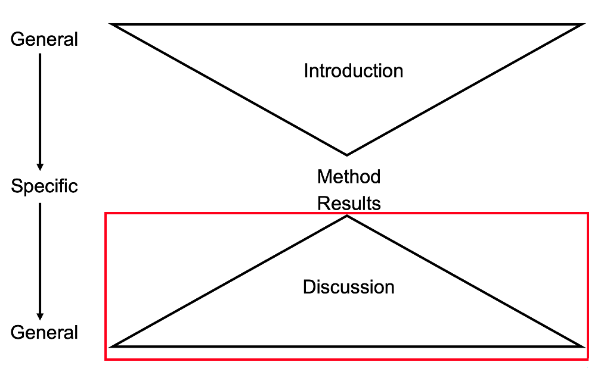

# Data Processing and Structure of the Discussion{#processing-discussion1}

## Data processing guidance 

On the RM1 Moodle page, you will see the Stage One and Stage Two Report Resources tab. Under Stage Two Resources, you will be able to access the full data set and a data processing guidance .Rmd file once the stage one deadline has passed. 

The data processing guidance file contains 12 prompts for what steps to complete when processing the full data, and adding your visualisations and analyses. Some prompts contain complete code chunks to run, some contain code chunks to edit, while others are completely blank. This is where you will put your all your data skills into practice, such as data wrangling, visualisation, and descriptive and inferential statistics. 

The guidance .Rmd file contains brief explanations and prompts, but here we are reinforcing what skills go into each component and what to think about to put your stage one report plan into action. 

### 1. Load in packages and data. 

The first code chunks provides a starting point to working with the data. It loads `tidyverse` and reads in both of the final data sets you will be working with. It is normally good practice to load all the packages you need at the start of the script, so if you need packages for later steps, add them into this code chunk rather than dispersing them throughout the script. 

**Key data skills**: 

- Chapter 3 - Starting with data. 

### 2. Clean up the data

The code chunk here should be run without edit, assuming the data you read in have the original object names. The code here will clean up the Experimentum data a little bit to help you on your way. Its taken from the [Experimentum manual](https://debruine.github.io/experimentum/data.html) to retain only the first time any participant completes the study. Without it, you can encounter various problems in later steps if there are duplicate user IDs. 

::: {.info data-latex=""}
While you do not need to edit this code chunk, read over it and work out what it is doing. You will recognise all the data wrangling functions, so identify what each line is doing to the raw data files. 
:::

**Key data skills**: 

- Chapter 4 - Data wrangling 1.

- Chapter 5 - Data wrangling 2.

- Chapter 6 - Data wrangling 3.

### 3. Join together the data files by their common columns

We provide the data as two separate files: one for demographics and one for the MSLQ questions. For further processing and analysis, you will want all of this information in one data frame. The code chunk is blank, so add in code to join the two data files by all their common columns. 

**Key data skills**: 

- Chapter 3 - Starting with data. 

- Chapter 4 - Data wrangling 1.

- Chapter 5 - Data wrangling 2.

- Chapter 6 - Data wrangling 3.

### 4. Use select to retain only the variables you need for your analysis 

At the moment, you will have many variables for all the demographics and all the MSLQ questions. You will not need all of the variables, so it will make it easier to work with if you just retain the ones you need. For example, the user_id, any demographic variables to use or report, and the MSLQ items  you need for your specific project. 

**Key data skills**: 

- Chapter 4 - Data wrangling 1.

- Chapter 5 - Data wrangling 2.

- Chapter 6 - Data wrangling 3.

### 5. If necessary, use `filter()` to retain only the observations you need. 

This is where you would think about your inclusion and/or exclusion criteria. In your stage one report, was your plan to only participants with certain characteristics in your study? For example, you might need to remove participants above a certain age, or only use mature students etc. If you do not need to filter things then leave this section blank or delete it. 

::: {.info data-latex=""}
Its normally a good idea to report how many participants you start with, and how many you exclude, to leave your final sample size you work with. So, if you do exclude people at this stage, think about how you would record the sample size at each stage. 
:::

**Key data skills**: 

- Chapter 4 - Data wrangling 1.

- Chapter 5 - Data wrangling 2.

- Chapter 6 - Data wrangling 3.

### 6. Explore the data to check what "type" each variable is 

At this point, you are getting close to applying the analysis steps for your data. Now, it would be a good time for some exploratory data analysis to understand what your data look like. For example, checking the variables to see whether they are a character, numeric, etc. Think about functions like `summary()`, `str()`, and `glimpse()` to check out each variable. Recode any necessary variables as factors and, if you would like to, change numeric codes (e.g., 1 for native speaker) into words to make it easier to read the output and make appropriate visualisations. You might also create some quick exploratory data analysis plots like histograms to check out the properties of your data. 

**Key data skills**: 

- Chapter 3 - Starting with data. 

- Chapter 4 - Data wrangling 1.

- Chapter 5 - Data wrangling 2.

- Chapter 6 - Data wrangling 3.

- Chapter 7 - Intro to data visualisation. 

### 7. Calculate the mean score for each participant for each sub-scale. 

There are two code chunks here and they provide a starting point for you to edit. One is intended for those working with different groups/a t-test, and the other is intended for those working with relationships/correlations. The code chunks take the MSLQ items and calculate a subscale score.

There are a few ways you can do this but the Experimentum documentation provides example code to make this easier. For now, you have to adapt the code for the variables you need - changing only a few names to make it work for your data. You may also want to change the `na.rm = TRUE` for the calculation of means depending on whether you want to only include participants who completed all questions.

::: {.warning data-latex=""}
There are two code chunks here, but you only need one. You will be able to run the code, but if you try and knit the file, you might get an error, but for the code chunks after this section. This is because at the top of the code chunk you are using, you must change `eval = FALSE` to `eval = TRUE` once you have amended your code. The reason it is currently set to FALSE is to allow the file to knit without your edits. `eval = FALSE` says ignore the code chunk. `eval = TRUE` says run the code chunk. So, when it comes to the code chunks after this, it would not have run the code and the object would not exist. So, make sure you edit the code chunk you need for your analysis. 
:::

**Key data skills**: 

- Chapter 3 - Starting with data. 

- Chapter 4 - Data wrangling 1.

- Chapter 5 - Data wrangling 2.

- Chapter 6 - Data wrangling 3.

### 8. Check assumptions

You should now have the data set in the format that you need for analysis. Now you should check that the data meets the assumptions of the tests you want to conduct. This will be, depending on analysis, aspects such as normality, linearity, homeoscedasticity, etc.

::: {.info data-latex=""}
Remember assumption checks are often a grey judgement call, there might not be a black and white decision. Many of the checks rely on visualisations and your interpretation, so it is about being able to rationalise and justify your decision to the reader. 
:::

**Key data skills**: 

- Chapter 9 - Correlations.

- Chapter 10 - t-tests.

- Chapter 12 - Screening data.

### 9. Data visualisation

Next, you should visualise the data for each analysis with your reader in mind. For a t-test you might want to visualise the data through a violin-boxplot. For a correlation, you would be looking for a scatterplot. Refer back to weeks 7 and 8 for considering which plot would be informative and how to format the plots in APA style. 

**Key data skills**: 

- Chapter 7 - Intro to data visualisation.

- Chapter 9 - Correlations.

- Chapter 10 - t-tests.

### 10. Calculate descriptive statistics

You may have already obtained some useful descriptive statistics from previous sections, but if not, or there are additional ones you want to include, calculate them here. This might include means, standard deviations, the sample size for various groups etc. If you already have the relevant information, then leave this blank.

::: {.info data-latex=""}
Remember to consider what descriptive statistics are appropriate for the data and assumptions you are working with. Would the mean and standard deviation be best, or the median and interquartile range? 
:::

**Key data skills**: 

- Chapter 4 - Data wrangling 1.

- Chapter 5 - Data wrangling 2.

- Chapter 6 - Data wrangling 3.

- Chapter 9 - Correlations.

- Chapter 10 - t-tests.

### 11. Statistical power

If you did not include a power analysis in your stage one report, you might want to try it now. You could add some code to check how many participants you would need to detect your Smallest Effect Size of Interest (SESOI) for an *a priori* power analysis. Alternatively, you could run the code to establish what effect size your final sample size was sensitive to detect for a sensitivity power analysis.

**Key data skills**: 

- Chapter 9 - Correlations.

- Chapter 10 - t-tests.

- Chapter 11 - Power and effect sizes. 

### 12. Inferential statistics

Finally, you can conduct your inferential statistical analysis. Remember the three key components of inferential statistics: null hypothesis significance testing, effect size, and a confidence interval. 

::: {.info data-latex=""}
Think about the decisions you made in the stage one report and what would best address your research question and hypothesis, like did you plan on using a one- or two-tailed test? 
:::

**Key data skills**: 

- Chapter 9 - Correlations.

- Chapter 10 - t-tests.

- Chapter 11 - Power and effect sizes. 

## Structure of the discussion 

Now we turn to the final major section of an empirical psychology report: the discussion. 

The discussion summarises your findings and puts them in context compared to previous studies that influenced you. Relating back to the hypothetico-deductive model, the discussion focuses on the final part of the cycle: as you move from your conclusions to considering how they fit in with previous research. 

There are four key components to the discussion:

- Brief summary of main findings 

- Relate your findings to previous findings and theory 

- Consideration of any limitations, generalisability, and future directions

- Conclusion

The discussion is the bottom of the hourglass shape of a report, starting narrow to summarise your findings and becoming broader as you get closer to the end. These components do not typically have sub-headings to present as specific sub-sections, but you might see some articles include sub-headings for limitations, future research directions, and the conclusion. Providing your topic sentences are clear enough, they are not essential. You would not need sub-headings for the summary and previous research to compare though, these are just components to ensure you cover. 

### Brief summary of main findings 

The first paragraph or so of the discussion summarises your findings without all the statistics you presented in the results. You might mention the key effect size(s), but this is not a repetition of the results section. The idea is to summarise your findings in plain English and link back to your research question and hypothesis (if applicable) so its clear to the reader what you conclude. 

### Relate your findings to previous findings and theory 

The longest component in the discussion, this is where you put your findings in context to previous studies and theory. You will reuse many of the references from the introduction as these are the studies that influenced you, so they are going to be the most relevant. However, you can still bring in new references if there is a relevant study you found in the meantime, or you found something you did not expect, so you had to identify additional evidence. 

The key consideration here is your are explaining to the reader how your work builds on what we already knew. Were your findings consistent with past studies, were they inconsistent? Did you find a smaller or larger effect size than previous studies? 

Discussions are quite speculative as you are providing explanations for your findings, but knowledge/research and evaluation skills are still important. It is still crucial to cite evidence in support of your ideas and bring in relevant theory to provide a framework for your explanations wherever possible.

### Consideration of any limitations, generalisability, and future directions

After putting your findings in context, you explain to the reader what your study could and could not tell you. Limitations are about highlighting weaknesses in your study and manage expectations, rather than overselling your results. 

It takes time to develop a sense of what a valid limitation is as its easy to make it sound like your study was useless. No study is perfect but likewise no study can cover everything. You do not need to list everything that was missing or include what you consider personal limitations like data analysis is not your strength. 

We will spend additional time on this in week 10 to develop a better sense of identifying and evaluating limitations, but for now, the key thing is identifying a feature of your study's method that you consider a weaknesses for what you can conclude. For example, you think your measure is useful but maybe you think it might not generalise to real life behaviour. So, you would outline your limitation, support your reasoning with evidence, and link to future research on what you would do in future to address the limitation. 

### Conclusion

The final part of your discussion and report is a brief conclusion. This is typically a paragraph or two to remind the reader of your take home message. Consider it an executive summary of what your research question was and what you found in your study. Its the final thing the reader will see, so recap all the key points you want them to remember. 

